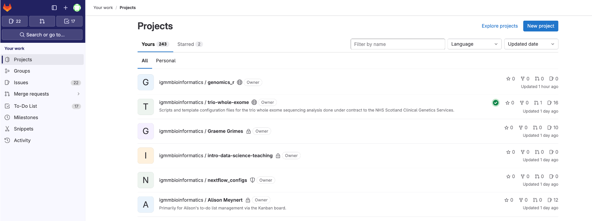
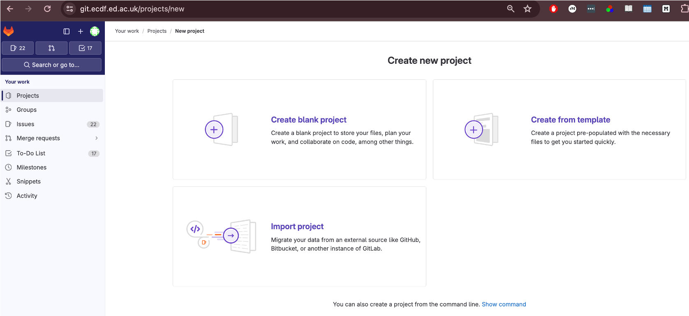

::: questions
-   What is a *remote* in Git?
-   How do I connect my local repository to one hosted on GitLab?
-   How do I share my work (push) and incorporate others' work (pull)?
-   What should I do if a push is rejected because my branch is behind?
:::

::: objectives
-   Define the term *remote* and list at least two common hosting services.
-   Clone an existing repository from GitLab to your computer with `git clone`.
-   Create a new remote connection with `git remote add` and publish code with `git push -u origin main`.
-   Retrieve updates with `git pull` and explain the difference between `git pull` and `git fetch`.
-   Resolve a simple *non‑fast‑forward* push rejection by pulling before pushing.
:::

## Introduction

A Git *remote* is a shorthand name for a version of your project hosted elsewhere, typically on a server like [GitLab](https://git.ecdf.ed.ac.uk/) or [GitHub](https://github.com/). Remotes allow you to **share** your history and **collaborate** with others.

## University of Edinburgh GitLab Repository

The University of Edinburgh provides a Git Repository hosting service using [GitLab](https://git.ecdf.ed.ac.uk) more information [here](https://www.wiki.ed.ac.uk/pages/viewpage.action?spaceKey=ResearchServices&title=GitLab)

Log into GitLab, [ttps://git.ecdf.ed.ac.uk, using your University of Edinburgh credentials.

### Create New Project

1.  Select **New project**

    

2.  Select **Create blank project**

    

3.  Add a Project Name **MyProject**

4.  **Un-tick** **Project Configuration-\>Initialize with A README**

5.  Click **Create Project**

    

6.This will create an Empty Repository, with details on how to link your existing git repository.


### GitLab security

To enable password less access to your remote, you can add your public SSH Key from Eddie to the remote repository.

#### Generating a new SSH key

You can generate a new SSH key on your local machine. After you generate the key, you can add the public key to your account on GitLab to enable authentication for Git operations over SSH.

The University guide can be found [here](https://www.wiki.ed.ac.uk/spaces/ResearchServices/pages/447372312/SSH+keys+best+practice+guide)

Example below

``` bash
[username@login02(eddie) ~]$ ssh-keygen -o -t ed25519
Generating public/private ed25519 key pair.
Enter file in which to save the key (/home/username/.ssh/id_ed25519):
Enter passphrase (empty for no passphrase):
Enter same passphrase again:
Your identification has been saved in /home/username/.ssh/id_ed25519.
Your public key has been saved in /home/username/.ssh/id_ed25519.pub.
The key fingerprint is:
SHA256:3t/tZzvbviR5Xs1YYYQeaGtI2n02W(and some more characters)hxxt (email address of the user)
The key's randomart image is:
+--[ED25519 256]--+
|  oo..   .  o... |
| o. o o ...o.+.  |
|  .+ + o+ +o+ .o |
| E  o o. o +.B. .|
|        S . = o .|
|       . . .  .+.|
|        . .  o.o+|
|           . .=o=|
|            . .O@|
+----[SHA256]-----+
```

This will generate two files: the private key file (in this example `/home/username/.ssh/id_ed25519`) and the public key file (`/home/username/.ssh/id_ed25519.pub`) - it is vitally important that you never share your private key

You can now add the contents of the public key file `id_ed25519.pub` to the GitLab.

Go to <https://git.ecdf.ed.ac.uk/-/user_settings/ssh_keys> then click add **new key**

\

## Git Remote on Eddie

Here we will link our existing repository on Eddie with the remote on GitLab, using the `git remote` command.

``` bash
$ git remote --help     # on eddie
```

To add out remote we use `git remote add` using the information on the blank GitLab Repository page.

``` bash
$ git remote add origin git@git.ecdf.ed.ac.uk:ggrimes2/myproject.git
```

We can now use the `git remote -v` command to see it has been linked.

``` bash
git remote -v
```

::: callout
Origin

The name "origin" for a git remote is not inherently special to Git's internal mechanics, but it is a widely accepted convention and has a few notable points:

Default Name: When you clone a repository from a remote source using git clone <repository_url>, Git automatically names the remote repository "origin" by default. It's just a convention that Git follows.

Widely Recognized: Because of this default behavior, many developers expect "origin" to refer to the primary or original repository from which the project was cloned. This shared understanding can help with clarity when collaborating.

Can be Renamed or Removed: There's nothing binding about the name "origin." You can rename it or even have multiple remotes with different names to track different repositories or branches.

In essence, "origin" is a convention, and while it's not mandatory to use, adhering to such conventions can make collaborative work smoother and more intuitive.

When you **clone** a repository you automatically get one remote called `origin`. If you start with a local repo (`git init`) you can add one later:
:::

### Syncing Repository

Now we have created an empty repository on the GitLab Server we can send the local changes to the remote using `git push`. The command `git push` tells Git, “Thanks for tracking these file changes. Now I want to upload these changes into the main project file.”

When you push your changes, you are essentially updating the remote repository with commits that have been made in your local repository

To do this, use the command

``` bash
# on eddie
$ git push origin main
#or shorthand
$ git push
```

In your case, you can type `git push origin main` where “origin” refers to the “remote repository” and “main” refers to the branch you want to upload.

If you go back to the repository on GitLab and refresh the page you will the repository has been synced with the local version.

### 

### 1.  Syncing Changes

Make a change to the `Readme.md file`

``` bash
$ nano Readme.md
```

Add this text, or something else, to the bottom of the `Readme.md` file

```         
## Data
The [data](https://figshare.com/articles/dataset/Data_Carpentry_Genomics_beta_2_0/7726454?file=14632895) is made available under an [Creative Commons license](https://creativecommons.org/licenses/by/3.0/).
```

Now we will, add, commit to our local repository and push changes to our remote repository.

``` bash
$ git status
$ git add Readme.md
$ git commit –m "Add Eddie and Data subsections"
$ git status
$ git push -u origin main # run once
$ git push # use this after
```

::: instructor
Learners often forget the `-u` flag on their *first* push. Emphasise that `git push -u origin main` sets up the **tracking relationship**, allowing future `git push`/`git pull` without extra arguments.
:::

### 3. Pulling changes

Suppose a collaborator adds commits to our remote repository. Now we need to get these changes locally. We can use the command `git pull` to keep your local repository up to date with the remote repository.

``` bash
$ git pull
```

If there is no divergence, Git performs a *fast‑forward* merge. Otherwise you may need to resolve conflicts before completing the merge.

### 4. Handling a rejected push

You may see:

``` text
! [rejected]   main -> main (non-fast-forward)
```

This means your local branch is **behind** the remote. Fix it by pulling, resolving any conflicts, then pushing again:

``` bash
$ git pull --rebase   # preferred: reapply your work on top of remote
# ...resolve conflicts if prompted...
$ git push
```

::::::::::: challenge
#### Challenge 1: Check your remote

1.  Run `git remote -v`.
2.  Which command would you use to rename the remote from *origin* to *source*?

::: solution
1.  The output lists fetch and push URLs for *origin*.
2.  `git remote rename origin source`.
:::

::::::::: challenge
#### Challenge 2: Upstream tracking

After cloning, what command shows which remote branch your local *main* is tracking?

::: solution
`git branch -vv` lists local branches with their upstream counterparts.
:::

::::::: challenge
#### Challenge 3: Predict the outcome

You run `git fetch origin` followed by `git log --oneline main..origin/main`. What will appear and why?

::: solution
The log shows commits that exist in *origin/main* but **not** in your local *main*; the two‑dot syntax lists commits reachable from the second reference and not the first.
:::

::::: challenge
#### Challenge 4: Clone vs init

List one advantage and one disadvantage of `git clone` compared to creating a repo with `git init` and then adding a remote.

::: solution
*Advantage:* `git clone` copies **all** history and configures the remote automatically, saving time.

*Disadvantage:* You cannot easily choose which files or branches to include during the initial copy (though `--depth` and `--branch` options help).
:::

## Summary diagram


::: keypoints
-   A *remote* is a named reference to a repository hosted elsewhere.
-   `git clone URL` copies a remote repository and sets up *origin*.
-   Publish an existing repo with `git remote add` followed by `git push -u origin <branch>`.
-   `git pull` equals `git fetch` + `git merge`; use `--rebase` to avoid unnecessary merges.
-   A push may be rejected if your branch is behind; pull (or fetch & merge) then push again.
:::
:::::
:::::::
:::::::::
:::::::::::
