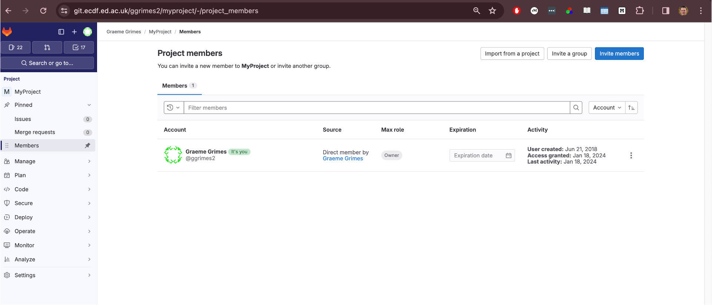
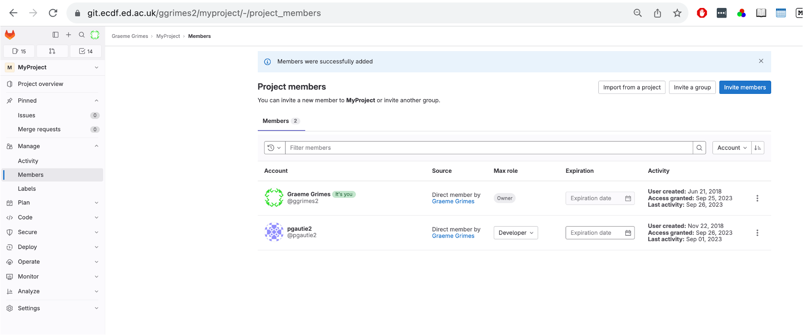
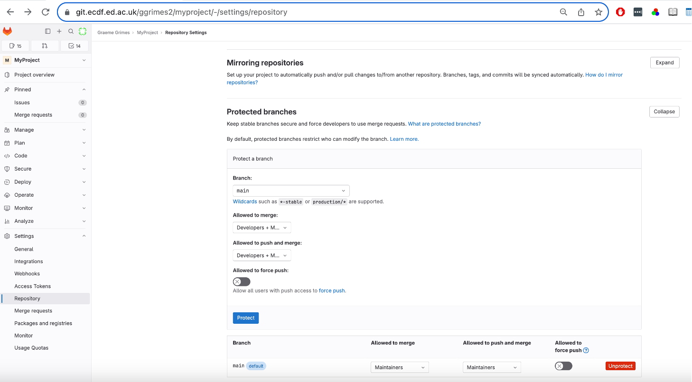
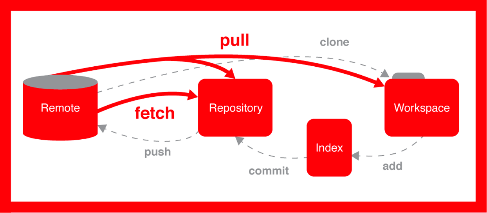
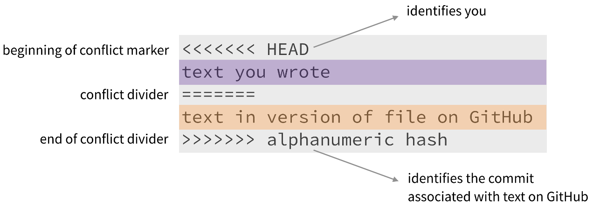

::: questions
-   How do I collaborate with others using Git?
-   What different models exist for Git collaboration?
-   What are protected branches, and how do I handle merge conflicts?
:::

::: objectives
-   Describe multiple models of collaboration using Git
-   Demonstrate how to add collaborators and manage permissions in GitLab
-   Practice cloning, committing, and pushing to a shared repository
-   Understand how to resolve common issues like push rejections and merge conflicts
:::

## Collaborating with Git

One of Git's most powerful features is that it makes collaboration straightforward and trackable. When working with others, a shared repository acts as the single source of truth. Contributors clone, modify, and then sync their work using version control commands like `pull`, `commit`, and `push`.

## Different Models for Collaboration

There are several ways to collaborate using Git:

-   **Shared repository model**: You give collaborators direct access to your repository. This is quick but requires trust.

-   **Fork-and-pull model**: A collaborator creates a copy (fork) of your repository, makes changes, and submits a *merge request* (also called a pull request). This is commonly used in open-source projects. It may not work between two private repositories.

For this exercise, we assume a **shared repository trust model**. That means you'll work directly in each other's repositories.

We’ll now walk through the process of adding a collaborator and working on the same project together.

## Step 1: Pair Up and Add a Collaborator

You will work in pairs. First:

-   Introduce yourselves.
-   Person 1: Get the UUN (University User Name) of Person 2.

### Add Member to Your Repository

**Person 1** should add **Person 2** as a collaborator on their GitLab repository:

1.  Click **Invite members**.
2.  Enter Person 2's UUN.
3.  Set the role to **Developer**.
4.  Go to the sidebar and click `Project → Members`.
5.  Confirm the role is set correctly.





## Step 2: Unprotect the Branch

In GitLab, branches can be protected to restrict who can push to them. To allow collaborators to push changes, you need to modify this setting:

-   Go to `Settings -> Repository -> Protected Branches`.
-   Find the `main` branch (or `master` depending on your setup).
-   Click **Unprotect**.



## Step 3: Clone the Repository

What if you were given a link to a folder from a remote location that you needed to get on your computer? How would you do that? You’d need to make a copy of the remote repository to your local machine. In the world of Git, this is referred to as “cloning.” The command for cloning is, you guessed it, `git clone`.


**Person 2** now clones the repository on their system (e.g., on Eddie):

``` bash
git clone https://git.ecdf.ed.ac.uk/<person1>/myproject.git project-collab
cd project-collab
git remote -v
```

This creates a local copy of the repository and shows the remote repository settings.



## Step 4: Check Who Edited What

Git provides the `blame` command to show who last modified each line of a file:

``` bash
git blame README.md
```

This is useful when debugging or understanding the origin of changes.

## Step 5: Make a Change and Commit

**Person 2** can now make a change to the `README.md` file:

``` bash
nano README.md  # or use any editor
```

After saving the file:

``` bash
git add README.md
git commit -m "Update README.md with message from Person 2"
```

## Step 6: Push the Changes

Now attempt to push:

``` bash
git push
```

::: callout
### Rejected?

If you see a "rejected" message, this likely means your local copy is behind the remote. You need to pull the latest changes:

``` bash
git pull
```

Then resolve any conflicts if necessary and try pushing again.
:::

## Merge Conflicts

Sometimes two collaborators edit the same part of a file. This creates a *merge conflict*.

Git will mark the conflict like this:



You must manually edit the file to resolve the conflict, then:

``` bash
git add filename
git commit -m "Resolve conflict in filename"
git push
```

::: callout
## Optional: Cache Your Credentials

If you're prompted for your credentials too often, you can cache them temporarily:

``` bash
git config --global credential.helper 'cache --timeout=3600'
```
:::

This caches your credentials for one hour.

::: keypoints
-   Git allows multiple collaboration models; shared access is fastest but requires trust.
-   GitLab permissions and protected branches must be configured for collaborators.
-   Always pull before pushing to avoid rejection.
-   Merge conflicts are normal and can be resolved with manual editing.
:::
