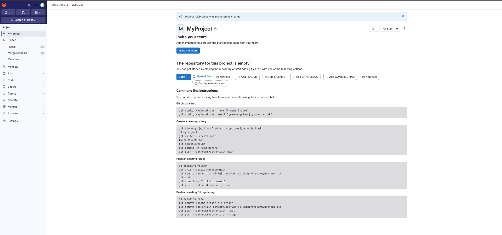
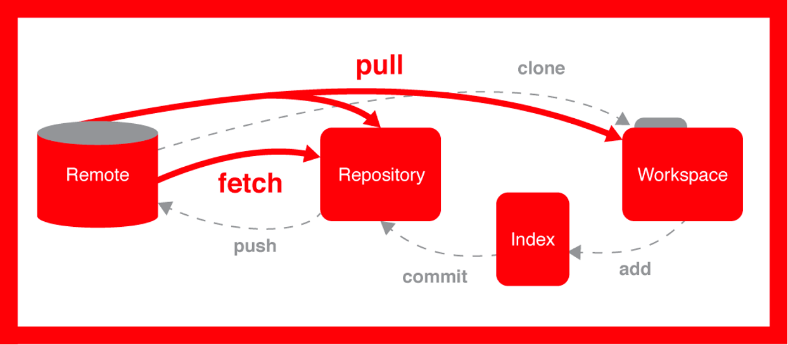
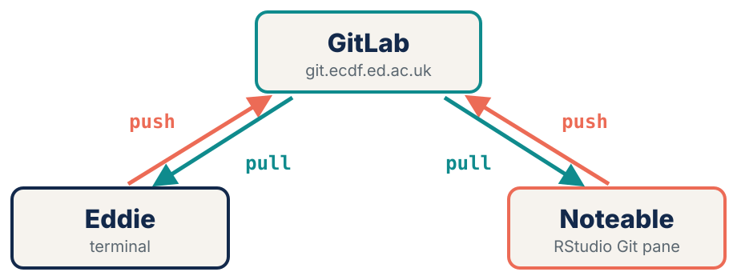
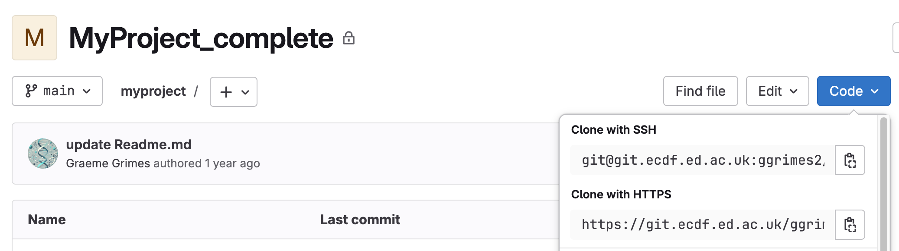
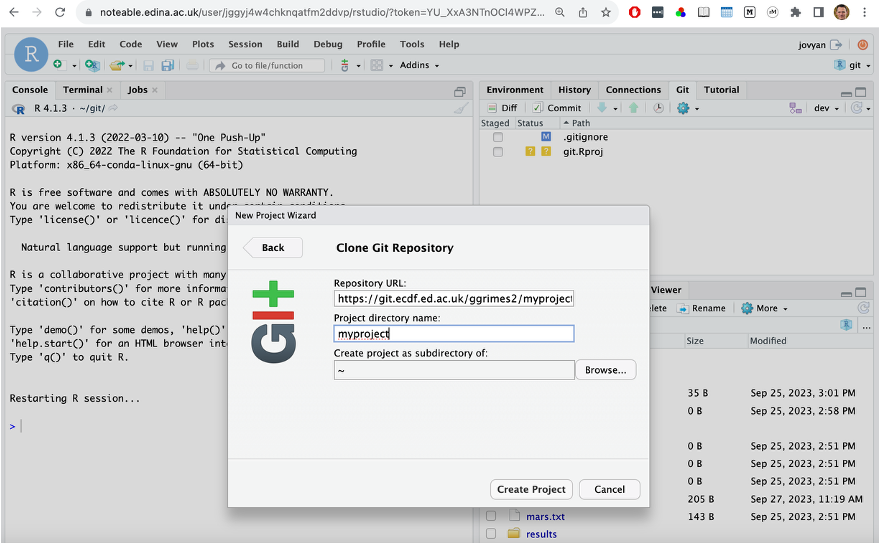
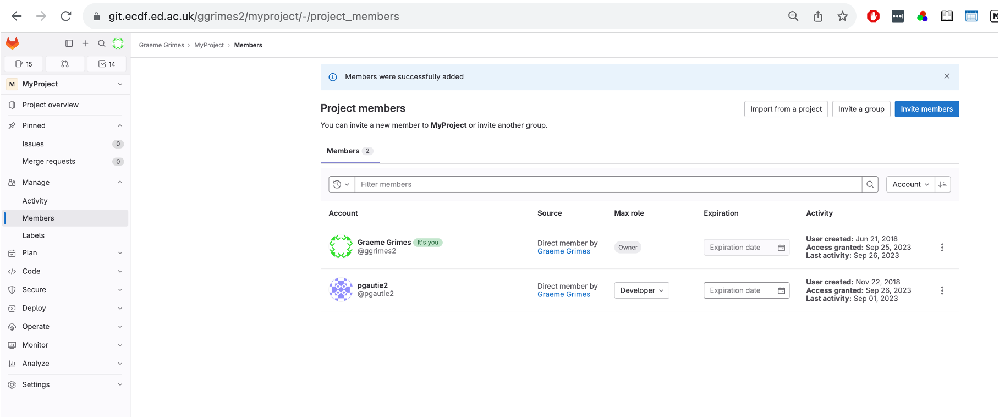
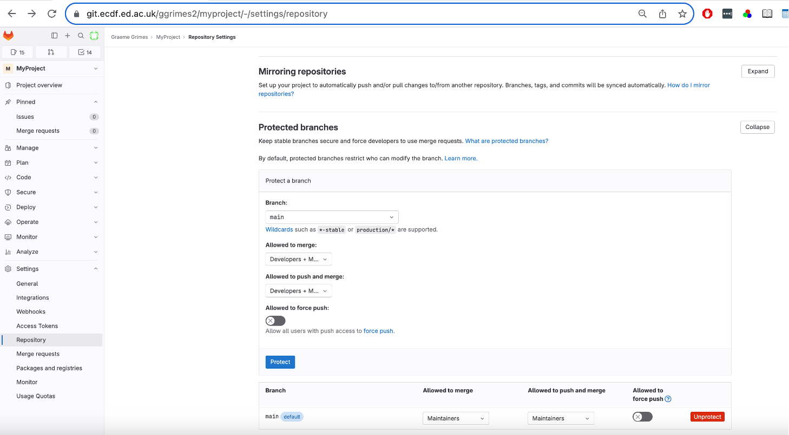
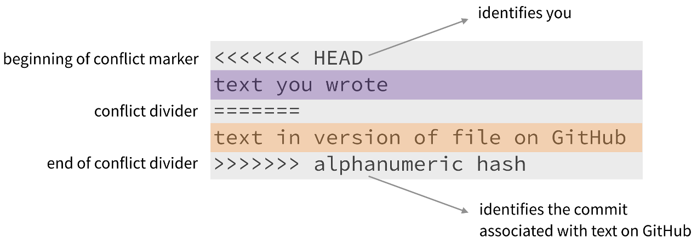

## Today's plan

:::: {.columns}
::: {.column width="50%"}
1. Why version control?
2. Configuring Git
3. Recording changes locally
4. Working with remotes (GitLab)
5. Git in RStudio on Noteable
:::
::: {.column width="50%"}
6. Collaborating
7. Exploring history
8. Ignoring things
9. Branching & tagging
10. Wrap up
:::
::::

<br>

::: {.muted .small}
Rough timetable: break **11:00** · lunch **12:30** · restart **13:30** · finish **16:00**. Keep a terminal logged in to Eddie open alongside the slides.
:::

::: notes
Welcome, introduce yourself and any helpers. Point at the timetable. Mention the QR code on the title slide goes to the lesson website: everything on the slides is there too, so nobody needs to copy commands off the screen.

Press S for this speaker view, M for the slide menu, ESC for the overview.
:::

## Before we start {.checklist}

:::: {.columns}
::: {.column width="58%"}
- Logged in to **Eddie**: `ssh <UUN>@eddie.ecdf.ed.ac.uk`
- On an interactive node: `qlogin`
- `git --version` prints a version number
- Logged in to **GitLab**: <https://git.ecdf.ed.ac.uk>
- Logged in to **Noteable** and can start **RStudio**
:::
::: {.column width="42%"}
**Sticky notes**

[]{.sticky .green} **Green**: I'm done / all good

[]{.sticky .red} **Red**: I'm stuck, please come over

<br>

::: {.muted .small}
Stick it on your laptop lid. Every exercise slide has a reminder at the bottom.
:::
:::
::::

::: notes
Do this check now, not at 14:00 when we get to Noteable. Walk the room while people log in. Anyone with a red sticky: get a helper there straight away.

Common problems: forgotten UUN password, not on the VPN / eduroam, qlogin queueing for a minute (that's normal).
:::

## Join the Wooclap {.wooclap-join}

:::: {.columns}
::: {.column width="55%"}
1. On your **phone** or laptop, go to **wooclap.com**
2. Enter the event code:

[]{.wooclap-code}

::: {.muted .small}
No account needed. Keep the tab open: we'll use it for the quiz questions all day.
:::
:::
::: {.column width="45%"}
[]{.wooclap-qr}
:::
::::

[]{.wooclap-embed-url}

::: notes
Open the Wooclap event on the presenter laptop now and leave it in a second window. Give people a minute to join; the participant count in Wooclap tells you when most are in.

Warm-up questions (Q1 and Q2 in the question bank) go straight after this.
:::

## Warm-up {.wooclap-poll}

[Answer on Wooclap · Q1–Q2 · ]{.wooclap-badge}

:::: {.columns}
::: {.column width="50%"}
::: {.poll}
**Q1.** How comfortable are you with the **command line**?

1 = never used it · 5 = live in it
:::
:::
::: {.column width="50%"}
::: {.poll}
**Q2.** One **word** that comes to mind when you hear *"version control"*
:::
:::
::::

::: notes
Q1 is a rating question, Q2 a word cloud. Switch to the Wooclap window to show the results. The rating tells you how fast to go this morning; it's asked again at the end of the day so everyone can see the change.
:::

## Wooclap Q1–Q2 · live {.wooclap-live}

[]{.wooclap-embed}

::: notes
Live Wooclap view: loads when you arrive on this slide. Open the question in Wooclap (or let participants go at their own pace) and show the votes as they come in. If the frame stays blank, use the link underneath.
:::

# Why Version Control? {.section-slide background-color="#13294b"}

[Episode 01]{.ep-num}

[What problem does version control solve, and when should I use Git?]{.ep-q}

::: notes
Episode 01: about 15 minutes, no hands-on apart from the quiz.
:::

## Sound familiar?

:::: {.columns}
::: {.column width="55%"}
- `report.docx`
- `report_final.docx`
- `report_final_v2.docx`
- `report_final_for_real_this_time.docx`
- `report_final_sent_to_boss.docx`
:::
::: {.column width="45%"}
*"I wish I could go back to the version I had yesterday, before I deleted that paragraph."*

<br>

::: {.muted .small}
Version control is designed to solve exactly this.
:::
:::
::::

::: notes
Ask for a show of hands: who has a folder that looks like this? Usually everyone. Ask whether anyone has lost work they couldn't get back.
:::

## What is Git?

A **version control system**: a dated, permanent record of every meaningful change to your project. Think of it as a **lab book for code**.

Not just for source code:

- configuration files and parameter sets
- small data files ([git lfs]{.muted} for large ones)
- documentation, papers, book chapters

::: {.muted .small}
Other systems exist (SVN, Mercurial, …) but Git is by far the most widely used.
:::

::: notes
The lab-book analogy works well with a wet-lab audience: dated, signed, you never tear out pages. Git is the tool; GitLab and GitHub are websites that host Git repositories. People often mix these up.
:::

## Why use it?

::: {.incremental}
- **Keep files in sync** across your laptop, work PC and **Eddie**
- **Provenance**: who changed what, when, and why?
- **Back up** precious work, and recover deleted files
- **Reproduce** the exact state of your code when you published a paper
- **Collaborate** safely with colleagues
- **Show off** your work, and take it with you when you change jobs
:::

::: notes
Reproducibility is the big one for researchers: reviewers and journals increasingly ask for the exact code. We come back to this with tags at the end of the day.
:::

## The Git workflow {auto-animate="true"}

::: {.flow}
[Working directory [README.md]{.filechip data-id="file"}]{.box data-id="wd"}
[`git add` →]{.arrow data-id="a1"}
[Staging area [README.md]{.filechip .ghost}]{.box .teal data-id="st"}
[`git commit` →]{.arrow data-id="a2"}
[Repository [README.md]{.filechip .ghost}]{.box .coral data-id="repo"}
:::

You **edit** a file. Git notices it has changed…

::: notes
Three slides animate the file moving through the three areas. Keep it slow: this model is the thing people most often get confused about all day.
:::

## The Git workflow {auto-animate="true"}

::: {.flow}
[Working directory [README.md]{.filechip .ghost}]{.box data-id="wd"}
[`git add` →]{.arrow data-id="a1"}
[Staging area [README.md]{.filechip .staged data-id="file"}]{.box .teal data-id="st"}
[`git commit` →]{.arrow data-id="a2"}
[Repository [README.md]{.filechip .ghost}]{.box .coral data-id="repo"}
:::

…`git add` puts it in the **staging area**: "this goes in the next snapshot"…

::: notes
Analogy: the staging area is a box you are packing. You can put things in and take them out before you seal it.
:::

## The Git workflow {auto-animate="true"}

::: {.flow}
[Working directory [README.md]{.filechip .ghost}]{.box data-id="wd"}
[`git add` →]{.arrow data-id="a1"}
[Staging area [README.md]{.filechip .ghost}]{.box .teal data-id="st"}
[`git commit` →]{.arrow data-id="a2"}
[Repository [README.md]{.filechip .committed data-id="file"}]{.box .coral data-id="repo"}
:::

- **Working directory**: the files you edit
- **Staging area**: a "waiting room" where you choose what goes into the next snapshot
- **Repository**: the permanent history of every snapshot (commit)

::: {.muted .small}
**edit → stage → commit.** You only need a handful of commands today.
:::

::: notes
…and git commit seals the box and files it in the history, forever. Why have a staging area at all? So one commit can hold one logical change even if you've edited five files.
:::

## Your turn: why bother? {.exercise}

[Answer on Wooclap · Q3 · ]{.wooclap-badge}

::: {.task time="2"}
Which of these is **not** a typical reason to use version control?

A. Keeping files synchronised between two laptops\
B. Tracking the history of code changes\
C. Encrypting files to keep them secret\
D. Collaborating with colleagues on a shared project
:::

::: {.answer .fragment}
**C.** Encryption is possible, but it is not what a version control system is for.
:::

::: notes
Quick show of fingers: 1–4 for A–D. Don't wait for the full two minutes if everyone has answered.
:::

## Wooclap Q3 · live {.wooclap-live}

[]{.wooclap-embed}

::: notes
Live Wooclap view: loads when you arrive on this slide. Open the question in Wooclap (or let participants go at their own pace) and show the votes as they come in. If the frame stays blank, use the link underneath. Tip: vote first, look at the spread here, then go back (←) and reveal the answer.
:::

# Configuring Git {.section-slide background-color="#0f8b8d"}

[Episode 02]{.ep-num}

[How does Git know who I am, and which settings should I change right away?]{.ep-q}

::: notes
Episode 02: about 20 minutes. Everyone types along from here.
:::

## Log in to Eddie

```bash
ssh <UUN>@eddie.ecdf.ed.ac.uk
qlogin
git --version
```

::: {.muted .small}
Run everything today on an interactive node (`qlogin`), not the login node.
:::

::: notes
Should already be done from the checklist. Anyone whose git --version is very old (1.x): flag it, some commands like git switch need 2.23+.
:::

## Three levels of configuration

| Level | File | Scope |
|:------|:-----|:------|
| System | `/etc/gitconfig` | Every user on the machine |
| **Global** | `~/.gitconfig` | All repositories for **you** |
| Local | `.git/config` | A single repository |

<br>

Git looks **local → global → system**: the closest level wins.

::: notes
Almost everything today is --global. Local config is useful if you want a different email on one project, e.g. a work vs personal repository.
:::

## Tell Git who you are

```bash
git config --global user.name "Your Name"
git config --global user.email "you@ed.ac.uk"
```

Only needed **once per machine**. Every commit you make is stamped with this name and email.

::: {.fragment .small}
⚠️ Your commit email becomes part of the public history of any repository you publish. Consider a "no-reply" address on public platforms.
:::

::: notes
Use the same email you use for GitLab so commits link to your profile. Remind them this needs repeating on every machine: Eddie now, Noteable later.
:::

## Sensible defaults

```{.bash code-line-numbers="|1|2|3|4|5"}
git config --global init.defaultBranch main   # name the first branch "main"
git config --global color.ui auto             # colour output
git config --global core.editor "nano -w"     # editor for commit messages
git config --global help.autocorrect 1        # run the closest command after 0.1 s
git config --global pull.rebase false         # git pull merges (today's default)
```

::: {.muted .small}
Older Git calls the first branch `master`. Setting `init.defaultBranch` keeps everything consistent with today's commands.
:::

::: notes
Step through line by line with the arrow key. The editor setting matters: without it, people get dropped into vim during a merge and can't get out. (If it happens anyway: Esc, then :wq, then Enter.)
:::

## Your turn: check your settings {.exercise}

::: {.task time="3"}
Run `git config --global --list`, then `cat ~/.gitconfig`.

Which **section header** (`[user]`, `[core]`, …) does each setting live under?
:::

::: {.answer .fragment}
`[user]` name, email · `[core]` editor · `[color]` ui · `[init]` defaultBranch · `[help]` autocorrect · `[pull]` rebase
:::

::: notes
The point: git config just edits a plain text file. Nothing magic.
:::

## Your turn: predict the result {.exercise}

[Answer on Wooclap · Q4 · ]{.wooclap-badge}

::: {.task time="3"}
- System: `user.email = root@machine`
- Global: *not set*
- Local: `user.email = user@project`

Which email is recorded when you commit **inside** the project? And in a **different** repository?
:::

::: {.answer .fragment}
Inside the project: **user@project** (local wins). Anywhere else: **root@machine** (falls back to system).
:::

::: notes
Discuss with a neighbour for a minute before revealing.
:::

## Wooclap Q4 · live {.wooclap-live}

[]{.wooclap-embed}

::: notes
Live Wooclap view: loads when you arrive on this slide. Open the question in Wooclap (or let participants go at their own pace) and show the votes as they come in. If the frame stays blank, use the link underneath.
:::

# Recording Changes Locally {.section-slide background-color="#13294b"}

[Episode 03]{.ep-num}

[How do I create a repository and record snapshots of my work?]{.ep-q}

::: notes
Episode 03: about 45 minutes. The core of the day. Aim to finish before the 11:00 break.
:::

## Create a repository

```bash
mkdir MyProject
cd MyProject
git init
git status
```

```{.output}
On branch main

No commits yet

nothing to commit (create/copy files and use "git add" to track)
```

`git init` creates a hidden `.git` folder that stores all future history.

::: notes
Show ls -a so they can see .git. Warn: never git init inside another repository, and never in your home directory.
:::

## File states

:::: {.columns}
::: {.column width="50%"}
[]{.chip style="background:#ec6b56"} **Untracked**: Git doesn't know about it yet

[]{.chip style="background:#e0a800"} **Modified**: changed since the last commit

[]{.chip style="background:#0f8b8d"} **Staged**: added, ready for the next commit

[]{.chip style="background:#13294b"} **Committed**: safely in the history
:::
::: {.column width="50%"}
::: {.flow style="flex-direction:column"}
[untracked / modified]{.box .coral}
[`git add` ↓]{.arrow}
[staged]{.box .teal}
[`git commit` ↓]{.arrow}
[committed]{.box}
:::
:::
::::

::: notes
git status tells you which state every file is in. Encourage them to run it constantly; it also tells you what to do next.
:::

## Add a README

```bash
echo "# My eddie Python project" > README.md
git status
```

```{.output}
Untracked files:
  (use "git add <file>..." to include in what will be committed)
    README.md
```

```bash
git add README.md
git status
```

```{.output}
Changes to be committed:
  (use "git rm --cached <file>..." to unstage)
    new file:   README.md
```

::: notes
Point out that git status prints hints in brackets: "use git add…". Git is quite helpful if you read what it says.
:::

## Commit the snapshot

```bash
git commit -m "initial commit"
```

```{.output}
[main (root-commit) 72041c0] initial commit
 1 file changed, 1 insertion(+)
 create mode 100644 README.md
```

Every commit gets a unique **hash**, shown here as `72041c0`.

::: {.fragment}
**Good commit messages**

- Subject line **≤ 50 characters**
- **Imperative mood**: "Add", not "Added" or "Adds"
- **Specific**: "Add error handling for login", not "Update code"
:::

::: notes
Their hashes will be different from mine; that's expected. A good test for a message: it completes the sentence "If applied, this commit will…".
:::

## Look at the history

```bash
git log
```

```{.output}
commit 72041c0b39884a9bf978bc272c82d862976abcb (HEAD -> main)
Author: firstname surname <emailaddress@ed.ac.uk>
Date:   Tue Sep 24 10:06:58 2024 +0100

    initial commit
```

`HEAD` is a pointer to **where you are** in the history.

```bash
git log --oneline
```

```{.output}
72041c0 (HEAD -> main) initial commit
```

::: notes
If the log fills the screen, press q to quit the pager. Someone always gets stuck here.
:::

## Make a change

```bash
nano README.md
```

```
# My eddie Python project

To run Python on eddie need to run:
module load igmm/apps/python/3.12.3
```

```bash
git status
```

```{.output}
Changes not staged for commit:
    modified:   README.md
```

::: notes
nano: Ctrl+O then Enter to save, Ctrl+X to exit. Say this out loud; people forget.
:::

## What changed? `git diff`

```bash
git diff README.md
```

```diff
diff --git a/README.md b/README.md
index a4c6c69..603f621 100644
--- a/README.md
+++ b/README.md
@@ -1 +1,4 @@
 # My eddie Python project
+
+To run Python on eddie need to run:
+module load igmm/apps/python/3.12.3
```

::: notes
Habit to build: always git diff before git add. It catches accidental edits and debugging print statements.
:::

## Anatomy of a diff {.diff-parts}

| Part | What it means |
|:--|:--|
| `diff --git a/README.md b/README.md` | the file being compared: **a/** = old version, **b/** = new version |
| `index a4c6c69..603f621 100644` | short IDs of the old and new file contents, then the file mode (normal file) |
| `--- a/README.md` | lines from the **old** version are marked with `-` |
| `+++ b/README.md` | lines from the **new** version are marked with `+` |
| `@@ -1 +1,4 @@` | a *hunk* header: old starts at line 1 (1 line), new starts at line 1 (4 lines) |
| ` # My eddie…` | a leading **space**: unchanged context line |
| `+module load…` | a leading **`+`**: line added |
| `-module load…` | a leading **`-`**: line removed |

::: {.small .muted}
An edited line shows up as a `-` line (old text) followed by a `+` line (new text).
:::

::: notes
Don't read the table row by row. The only lines most people need are the + and - ones. The rest is for reference.
:::

## Stage, commit, compare

```bash
git add README.md
git commit -m "Describe how to run Python on eddie"
git diff HEAD~1 README.md     # compare with one commit ago
```

<br>

| Command | Compares |
|:--|:--|
| `git diff` | working directory ↔ staging area |
| `git diff --staged` | staging area ↔ last commit |
| `git diff HEAD` | working directory ↔ last commit |
| `git diff HEAD~1` | now ↔ one commit ago |

::: notes
Map the table back to the three boxes from the workflow animation. There's a quiz question on git diff HEAD later.
:::

## Undoing changes

```bash
git restore README.md           # discard unstaged edits
git restore --staged README.md  # unstage, keep the edits
```

::: {.small .muted}
Older Git: `git checkout -- README.md`
:::

<br>

⚠️ `git restore` **permanently** discards edits that were never staged or committed.

::: notes
This is the one place Git can genuinely lose work: edits that were never committed. Everything that has been committed can be recovered. More on undoing things in Episode 07.
:::

## Directories and data

Git tracks **files**, not empty directories:

```bash
mkdir Src
touch Src/.gitkeep
git add Src/.gitkeep
```

Add a small dataset:

```bash
mkdir Data
cp /exports/igmm/software-rl9/bac/dataWranglingGenomics/20230529/workshop_data/combined_tidy_vcf.csv Data/data.csv
git add Data/data.csv
git commit -m "Add example dataset"
```

::: {.muted .small}
Small, stable data is fine to commit. Large or sensitive data: see *Ignoring Things*.
:::

::: notes
The copy path is long: tell people to use the copy button on the lesson website rather than retyping it.
:::

## Your turn: a Python script {.exercise}

::: {.task time="10"}
1. Create `Src/hello.py`, then add and commit it:

```python
#!/usr/bin/env python
print("Hello World!")
```

2. Change it to read the CSV and print the number of rows. Check `git diff` before you commit.
:::

::: {.answer .fragment}
```python
#!/usr/bin/env python
import pandas as pd

variants = pd.read_csv("Data/data.csv")
print(len(variants))
```

`git diff Src/hello.py` → `git add Src/hello.py` → `git commit -m "Read CSV and report row count"`
:::

::: notes
Start the timer. They need module load for Python (see README) to actually run it; running it isn't required. Fast finishers: git log --oneline and count the commits so far (should be 4).

Break at 11:00 after this.
:::

# Working with Remotes {.section-slide background-color="#0f8b8d"}

[Episode 04]{.ep-num}

[How do I connect my repository to GitLab, and push and pull changes?]{.ep-q}

::: notes
Episode 04: about 45 minutes. The SSH key step is where people get stuck: have helpers ready.
:::

## What is a remote?

:::: {.columns}
::: {.column width="55%"}
A **remote** is a saved link to another copy of your repository, usually on a server.

It lets you **share** your history and **collaborate**.

Hosting services:

- **University GitLab**: <https://git.ecdf.ed.ac.uk>
- GitHub, gitlab.com, Bitbucket, …
:::
::: {.column width="45%"}
::: {.flow style="flex-direction:column"}
[Remote (GitLab)]{.box .teal}
[`git push` ↑ &nbsp; ↓ `git pull`]{.arrow}
[Local (Eddie)]{.box}
:::
:::
::::

::: notes
Every copy is a full copy with all the history. GitLab is not "the real one"; it's just the one everyone agrees to sync through.
:::

## Create a GitLab project

:::: {.columns}
::: {.column width="55%"}
{fig-alt="GitLab Create blank project form with Project name MyProject and Initialize repository with a README unticked."}
:::
::: {.column width="45%"}
1. Log in to <https://git.ecdf.ed.ac.uk>
2. **New project** → **Create blank project**
3. Project name: **MyProject**
4. **Untick** *Initialize repository with a README*
5. **Create project**
:::
::::

::: notes
Stress unticking the README box. If they leave it ticked, the first push is rejected because GitLab has a commit they don't. If that happens: git pull --allow-unrelated-histories, then push.
:::

## An empty repository

{.r-stretch fig-align="center" fig-alt="New empty MyProject page on GitLab showing command line instructions."}

::: {.small .muted style="text-align:center"}
GitLab shows the commands for pushing an existing repository. We'll use the SSH address.
:::

::: notes
We already have a repository, so we use the "Push an existing Git repository" section.
:::

## SSH keys: password-less access

```bash
[username@login02(eddie) ~]$ ssh-keygen -t ed25519
```

Creates two files:

- `~/.ssh/id_ed25519`: **private** key. Never share it!
- `~/.ssh/id_ed25519.pub`: **public** key. Paste this into GitLab.

[User icon > Preferences > Access > SSH Keys > Add new key]{.menu}

::: {.muted .small}
See the University's *SSH keys best practice guide* for details.
:::

::: notes
Analogy: the public key is a padlock you hand out; the private key is the only key that opens it. cat ~/.ssh/id_ed25519.pub and copy the single line. Test with ssh -T git@git.ecdf.ed.ac.uk: it should say "Welcome to GitLab".
:::

## Connect and push

```{.bash code-line-numbers="|1|2|3"}
git remote add origin git@git.ecdf.ed.ac.uk:<username>/myproject.git
git remote -v
git push -u origin main
```

- `origin` is the conventional name for your main remote
- `-u` sets up **tracking**: after this, plain `git push` and `git pull` just work

::: {.fragment .small .muted}
Forget `-u` on your first push and Git will complain there is "no upstream branch".
:::

::: notes
Step through: add the remote, check it, then push. Copy the SSH URL from the GitLab page rather than typing it. If they made a typo: git remote set-url origin <correct-url>.
:::

## Pushed!

{.r-stretch fig-align="center" fig-alt="MyProject page on GitLab after pushing, listing the Data and Src folders and the README file."}

::: notes
Refresh the GitLab page. Click into Commits to show the same history as git log.
:::

## Sync a change

Add a **Data** section to `README.md` on Eddie:

```
## Data
The [data](https://figshare.com/articles/dataset/Data_Carpentry_Genomics_beta_2_0/7726454?file=14632895)
is made available under a [Creative Commons license](https://creativecommons.org/licenses/by/3.0/).
```

```bash
git add README.md
git commit -m "Add Data section"
git push
```

Refresh GitLab: the rendered README shows your new section.

::: notes
The payoff moment: the Markdown renders nicely on GitLab. A good README is the front page of the project.
:::

## Pull, fetch and rejected pushes

{height="250" fig-align="center" fig-alt="Diagram: fetch brings remote changes into the local repository, pull brings them into the workspace."}

- `git fetch`: download changes, don't touch your files
- `git pull` = `git fetch` + `git merge`

```{.output}
! [rejected]   main -> main (non-fast-forward)
```

Your branch is **behind** → `git pull`, resolve any conflicts, then `git push` again.

::: notes
A rejected push is not an error in your work. It just means someone else pushed first. Everyone will see this during the collaboration episode.
:::

## Your turn: remotes {.exercise}

::: {.task time="3"}
1. Run `git remote -v`. What do you see?
2. What command shows which remote branch your local `main` is tracking?
:::

::: {.answer .fragment}
1. The **fetch** and **push** URLs for `origin`.
2. `git branch -vv` lists local branches with their upstream counterparts.
:::

::: notes
Lunch at 12:30, probably around here.
:::

# Git in RStudio {.section-slide background-color="#13294b"}

[Episode 05]{.ep-num}

[How can I use Git through a graphical interface on Noteable?]{.ep-q}

::: notes
Episode 05: about 30 minutes. Good after lunch: less typing, more clicking.
:::

## Why a GUI?

:::: {.columns}
::: {.column width="45%"}
- A visual alternative to typing commands
- Easier to **see** changes and history
- Most IDEs (RStudio, VS Code) have Git built in
- **Same Git underneath**: every button runs a shell command

::: {.muted .small}
Noteable: <https://noteable.edina.ac.uk/login>
:::
:::
::: {.column width="55%"}
{.diagram fig-alt="GitLab at the top, Eddie bottom left and Noteable bottom right; each machine pushes up to GitLab and pulls down from it."}
:::
::::

::: notes
Key idea: Eddie and Noteable never talk to each other directly. Everything goes through GitLab: push from one, pull on the other.
:::

## Configure Git on Noteable

A new machine needs its own Git configuration. In RStudio's **Terminal** pane:

```bash
git config --global user.name "Your Name"
git config --global user.email "you@ed.ac.uk"
pip install pandas      # needed for our script
```

::: notes
Same as this morning: once per machine. The Terminal tab is next to the Console tab in RStudio.
:::

## Clone with RStudio

:::: {.columns}
::: {.column width="50%"}
{fig-alt="GitLab Code drop-down showing Clone with SSH and Clone with HTTPS addresses."}

{fig-alt="RStudio Clone Git Repository dialog with the GitLab URL and project directory name myproject."}
:::
::: {.column width="50%"}
1. On GitLab: **Code** → copy **Clone with HTTPS**
2. RStudio: [File > New Project > Version Control > Git]{.menu}
3. Paste the URL, choose a folder
4. **Create Project**

<br>

The **Git** pane appears top-right.
:::
::::

::: notes
HTTPS here because Noteable has no SSH key set up; it will ask for your GitLab username and password (or a personal access token).
:::

## Commit and push from RStudio

1. Edit `README.md` and save
2. **Git** pane → tick the file to **stage** it
3. **Commit** → write a message → **Commit**
4. **Push** ↑

<br>

Check GitLab: **Repository → Commits** shows your message.

::: notes
Point out that the tick box is git add, the Commit button is git commit, and the green arrow is git push. Same three steps.
:::

## Your turn: round trip {.exercise}

::: {.task time="15"}
1. On **Noteable**: edit `Src/hello.py`, commit and **push**.
2. On **Eddie**: `git pull`. Is the change there?
3. On **Eddie**: add a *Using Noteable* section to the README, commit and push.
4. On **Noteable**: **Pull** ↓
:::

::: {.answer .fragment}
Both copies stay in sync through GitLab: **commit → push** on one machine, **pull** on the other. Always pull before you start work!
:::

::: notes
This is the round-trip diagram from two slides back. Walk around; the usual problem is forgetting to push before pulling on the other side.
:::

# Collaborating {.section-slide background-color="#0f8b8d"}

[Episode 06]{.ep-num}

[How do I work on the same repository as a colleague?]{.ep-q}

::: notes
Episode 06: about 40 minutes. Pair people up before starting. An odd number is fine: make one group of three.
:::

## Models for collaboration

- **Shared repository**: give collaborators direct access. Quick, but needs **trust**.
- **Fork and merge request**: a collaborator copies (forks) your repo, changes it, and asks you to merge. Common in open source.

<br>

Today: **shared repository** in pairs.

[Break into pairs · Person 1 gets Person 2's UUN]{.pill}

::: notes
Shared repository suits a lab group. Forks suit a public tool where you don't know the contributors.
:::

## Person 1: add a member

:::: {.columns}
::: {.column width="55%"}
{fig-alt="GitLab Project members page with a collaborator added as Developer."}
:::
::: {.column width="45%"}
1. [Project > Members]{.menu}
2. **Invite members**
3. Enter Person 2's **UUN**
4. Role: **Developer**
5. Check the members list
:::
::::

::: notes
Person 2 needs to have logged in to GitLab at least once or they won't appear in the search.
:::

## Person 1: unprotect `main`

:::: {.columns}
::: {.column width="55%"}
{fig-alt="GitLab Protected branches settings with an Unprotect button next to main."}
:::
::: {.column width="45%"}
By default GitLab only lets **Maintainers** push to `main`.

[Settings > Repository > Protected branches]{.menu}

Click **Unprotect** next to `main`.
:::
::::

::: notes
In real projects you'd usually keep main protected and use branches plus merge requests (Episode 09). We unprotect it today to keep things simple.
:::

## Person 2: clone, change, push

```bash
git clone https://git.ecdf.ed.ac.uk/<person1>/myproject.git project-collab
cd project-collab
git blame README.md          # who last changed each line?
nano README.md
git add README.md
git commit -m "Update README with message from Person 2"
git push
```

::: {.fragment}
**Rejected?** Your copy is behind: `git pull`, then `git push` again.
:::

::: notes
Clone into project-collab so it doesn't clash with their own MyProject folder. Person 1 then pulls to see Person 2's change.
:::

## How a conflict happens

{.diagram fig-align="center" fig-alt="Commit graph: both people start from the same commit; Person 1 edits line 3 and pushes first; Person 2 edits the same line, their push is rejected, and git pull reports a conflict."}

Git merges changes to **different** lines automatically. Only the **same line** changed two ways needs you to decide.

::: notes
Conflicts are normal, not a failure. Git refuses to guess which version of your science is right.
:::

## Merge conflicts

{height="330" fig-align="center" fig-alt="Merge conflict markers: <<<<<<< HEAD, your text, =======, their text, >>>>>>> commit hash."}

Edit the file to keep what you want, **delete the markers**, then:

```bash
git add README.md
git commit -m "Resolve conflict in README"
git push
```

::: notes
Above ======= is your version (HEAD); below it is theirs. You can keep one, the other, or write a combination. Just make sure all three marker lines are gone.
:::

## Your turn: make a conflict {.exercise}

::: {.task time="15"}
Both partners edit the **same line** of `README.md` and commit.

Person 1 pushes first. Person 2 then pushes.

What happens, and how do you fix it?
:::

::: {.answer .fragment}
Person 2's push is **rejected**. `git pull` reports a **conflict**; open the file, choose the text to keep, remove the `<<<<<<<` `=======` `>>>>>>>` markers, then `add` → `commit` → `push`.
:::

::: notes
Then swap roles and do it again so both people resolve one. If git pull opens an editor for the merge message, it's nano (we configured it): Ctrl+O, Enter, Ctrl+X.
:::

## Forking & caching credentials

:::: {.columns}
::: {.column width="50%"}
**Fork**

Click **Fork** on a project page to get your own copy on GitLab, e.g. <https://git.ecdf.ed.ac.uk/ggrimes2/git4igc>
:::
::: {.column width="50%"}
**Tired of typing your password?**

```bash
git config --global \
  credential.helper 'cache --timeout=3600'
```

Caches credentials for one hour.
:::
::::

::: notes
Optional: demo a fork on screen if time allows; don't make everyone do it.
:::

# Exploring History {.section-slide background-color="#13294b"}

[Episode 07]{.ep-num}

[How can I find out what changed, when, and by whom, and how do I undo mistakes?]{.ep-q}

::: notes
Episode 07: about 35 minutes. By now everyone's repository has some real history to explore.
:::

## `git log`

```bash
git log                              # full history
git log --oneline                    # one line per commit
git log --graph --oneline --decorate # branches and merges
git log -p README.md                 # changes to one file
git log --author="Your Name"         # one person's commits
```

::: notes
The --graph version now shows the merge from the conflict exercise. Worth pointing at.
:::

## `git show` and `git diff`

```bash
git show a3f2d4e              # message, author and changes in one commit
git show HEAD~2:README.md     # a file as it was two commits ago
git diff abc123 def456        # between two commits
git diff HEAD~1 HEAD README.md
```

`HEAD~N` = *N commits before* where you are now.

::: notes
You only need the first 6–7 characters of a hash.
:::

## Going back

```bash
git restore README.md                       # discard unstaged edits
git restore --staged README.md              # unstage
git restore --source=HEAD~1 README.md       # file from an earlier commit
```

<br>

In RStudio: **Git** pane → **History** shows the same log graphically.

```bash
git blame README.md      # who last changed each line
```

::: notes
restore --source brings back an old version of the file as an uncommitted change. You then commit it like any other edit.
:::

## Oops! Undoing mistakes {.dense}

| Situation | Fix |
|:--|:--|
| Typo in the last commit message | `git commit --amend -m "Better message"` |
| Forgot a file in the last commit | `git add forgotten.py` → `git commit --amend --no-edit` |
| A bad commit is **already pushed** | `git revert <hash>`: a *new* commit that undoes it |
| Half-done edits, but need to `git pull` | `git stash` → `git pull` → `git stash pop` |
| Deleted or broke a file (not committed) | `git restore <file>` |

::: {.warn}
**Golden rule:** only `--amend` commits you have **not pushed** yet. Once something is on GitLab, use `git revert`, which adds history instead of rewriting it.
:::

::: notes
This is the slide people photograph. Amend rewrites the last commit, so if a colleague already pulled it their history no longer matches yours. Revert is always safe.
:::

## `revert` and `stash` in action

:::: {.columns}
::: {.column width="50%"}
```bash
git revert HEAD --no-edit
git log --oneline
```

```{.output}
b7e1f02 Revert "Add Data section"
9c2a1d4 Add Data section
72041c0 initial commit
```

::: {.small .muted}
The mistake stays in the history, along with its fix.
:::
:::
::: {.column width="50%"}
```bash
git stash          # put edits aside
git pull           # now safe to pull
git stash pop      # edits come back
git stash list
```

::: {.small .muted}
A stash is a clipboard for uncommitted work.
:::
:::
::::

::: notes
Demo revert live if time allows. Stash: use it when git pull refuses to run because it would overwrite your local edits.
:::

## Your turn: undo it {.exercise}

::: {.task time="5"}
1. Add a silly line to `README.md` and commit it with the message `"oops"`.
2. Fix the message to `"Add silly line"` **without** a new commit.
3. Push, then undo the whole commit **safely**.
:::

::: {.answer .fragment}
```bash
git commit --amend -m "Add silly line"   # before pushing: rewrite is fine
git push
git revert HEAD --no-edit                # after pushing: add an undo commit
git push
```
:::

::: notes
Check with git log --oneline: they should see both "Add silly line" and "Revert Add silly line".
:::

## Your turn: `git diff HEAD` {.exercise}

[Answer on Wooclap · Q5 · ]{.wooclap-badge}

::: {.task time="2"}
What does `git diff HEAD` show?

a) working directory ↔ staging area
b) staging area ↔ last commit
c) working directory ↔ last commit
d) two different commits
:::

::: {.answer .fragment}
**c)**. `git diff HEAD` shows everything that has changed since the last commit, staged or not.
:::

::: notes
Fingers up 1–4 again.
:::

## Wooclap Q5 · live {.wooclap-live}

[]{.wooclap-embed}

::: notes
Live Wooclap view: loads when you arrive on this slide. Open the question in Wooclap (or let participants go at their own pace) and show the votes as they come in. If the frame stays blank, use the link underneath.
:::

## Your turn: the archaeologist {.exercise}

::: {.task time="5"}
Find the **very first version** of `README.md`.

*Hint:* combine a commit hash and a filename in `git show`.
:::

::: {.answer .fragment}
```bash
git log --oneline        # oldest commit is at the bottom
git show 72041c0:README.md
```
:::

::: notes
Their hash will differ from 72041c0. Fast finishers: git log --reverse --oneline puts the oldest first.
:::

# Ignoring Things {.section-slide background-color="#0f8b8d"}

[Episode 08]{.ep-num}

[How do I stop Git tracking files I don't want in the repository?]{.ep-q}

::: notes
Episode 08: about 20 minutes.
:::

## `.gitignore`

Files you usually **don't** want to track:

- temporary files from your editor or IDE
- outputs you can regenerate
- large data or binary files
- anything **sensitive**: passwords, keys, patient data

```bash
nano .gitignore
```

```
.Rhistory
.RData
.Rproj.user/
results/
*.dat
```

::: notes
Patterns: *.dat matches any file ending .dat; results/ ignores the whole folder. Templates for most languages: github.com/github/gitignore.
:::

## Large data on Eddie {.dense}

:::: {.columns}
::: {.column width="55%"}
- Git keeps **every version forever**: commit a 20 GB BAM once and it stays in `.git` even after you delete it
- GitLab has **size limits**: big pushes get rejected
- Commit the **scripts** and a README that says **where the data lives** on Eddie / DataStore
- Check how big your repository is: `du -sh .git`
:::
::: {.column width="45%"}
```
# .gitignore for genomics
*.bam
*.bai
*.cram
*.fastq.gz
*.vcf.gz
results/
work/
```
:::
::::

::: {.warn}
Already committed a big file? `git rm --cached big.bam` stops tracking it, but it is **still in the history**. Ask for help **before** you push.
:::

::: notes
The most common Git disaster on an HPC system. Removing a file from history needs tools like git filter-repo, which is out of scope today. Prevention is much easier: set up .gitignore first. work/ is Nextflow's work directory.
:::

## Commit it, and a gotcha

```bash
git add .gitignore
git commit -m "Ignore temporary and output files"
```

<br>

⚠️ `.gitignore` only affects **untracked** files. To stop tracking a file you already committed:

```bash
git rm --cached filename
```

::: {.muted .small}
Ignore on your machine only, without sharing: add patterns to `.git/info/exclude`.
:::

::: notes
--cached keeps the file on disk and only removes it from Git's index.
:::

## Your turn: ignore a secret {.exercise}

::: {.task time="5"}
1. Create `secret.txt` containing some text.
2. Add it to `.gitignore`.
3. Run `git status`. Is it listed?
4. Commit your `.gitignore`.
:::

::: {.answer .fragment}
```bash
echo "my password" > secret.txt
echo "secret.txt" >> .gitignore
git status        # secret.txt no longer appears
git add .gitignore
git commit -m "Add gitignore to exclude secret.txt"
```
:::

::: notes
Note the double >> appends. A single > would overwrite the whole .gitignore.
:::

# Branching & Tagging {.section-slide background-color="#13294b"}

[Episode 09]{.ep-num}

[How do I develop in parallel, and mark important versions?]{.ep-q}

::: notes
Episode 09: about 40 minutes. The last hands-on episode.
:::

## Why branch?

- **Test a change** without breaking the working version
- **Collaborate** without editing the same code at the same time
- Keep an **experiment** separate until it's worth keeping

<br>

A branch is a **label pointing to a commit** that moves forward as you commit. Creating one is instant: nothing is copied.

::: notes
Analogy: a branch is a sticky note on a page of the lab book that you move forward as you write.
:::

## Create and switch

```{.bash code-line-numbers="|1|2|3"}
git branch             # list branches: * marks the current one
git branch dev         # create dev
git switch dev         # move to it (older Git: git checkout dev)
```

```{.output}
* dev
  main
```

::: {.small .muted}
Create and switch in one step: `git switch -c dev`
:::

::: notes
The prompt doesn't show the branch on Eddie by default, so git status or git branch is how you check where you are.
:::

## Commit on a branch

:::: {.columns}
::: {.column width="50%"}
```{.bash code-line-numbers="|1-3|4-5|6"}
nano Src/summary.py
git add Src/summary.py
git commit -m "Add summary.py"
git switch main
ls Src     # no summary.py!
git log --oneline --graph --all
```
:::
::: {.column width="50%"}
{.diagram fig-alt="Commit graph: main has 'initial commit' and 'Add example dataset'; dev branches off and adds 'Add summary.py'. HEAD points at main."}
:::
::::

::: notes
Step through: commit on dev, switch back to main, the file vanishes. This surprises people: it's not deleted, it lives on dev. Switch back to dev and it reappears.
:::

## Compare and merge

```bash
git diff main..dev     # what would dev bring in?
git switch main
git merge dev
```

```{.output}
Updating 370eb9d..83e878e
Fast-forward
 Src/summary.py | 8 ++++++++
```

**Fast-forward**: `main` had no new commits, so Git just moves the `main` label up to `dev`.

::: notes
Always switch to the branch you want to merge into first, then merge the other branch into it.
:::

## Fast-forward or merge commit?

{.diagram fig-align="center" fig-alt="Left: fast-forward, where main simply moves along to the tip of dev. Right: both branches have new commits, so Git creates a merge commit joining them."}

::: {.small .muted style="text-align:center"}
A merge commit is where a **conflict** can appear, exactly like the one you fixed in Episode 06.
:::

::: notes
The conflict this afternoon was a merge commit too: git pull merged origin/main into your main.
:::

## Share, review, tidy up

```{.bash code-line-numbers="|1|2|3"}
git push origin dev              # publish the branch to GitLab
git branch -d dev                # delete it locally once merged
git push origin --delete dev     # …and on GitLab
```

On GitLab, a **merge request** lets collaborators review a branch before it's merged into `main`.

::: {.fragment .small}
**Detached HEAD?** You checked out a commit, not a branch. Get back with `git switch main`.
:::

::: notes
If time allows, open a merge request on GitLab on screen: show the diff view and the comment box. That's how most real teams work.
:::

## Tags: a label that never moves

:::: {.columns}
::: {.column width="50%"}
**Branch** → moves with each commit

**Tag** → fixed on one commit, forever

<br>

Use tags for:

- the code behind a **paper**
- a **release** (`v1.0`, `v1.1`)
- the end of a milestone
:::
::: {.column width="50%"}
```bash
git tag -a v1.0 -m "Version used for the workshop report"
git tag
git show v1.0
git diff v1.0 main
git push origin v1.0
```

::: {.small .muted}
GitLab: [Code > Tags]{.menu}, then download that version or create a **Release**.
:::
:::
::::

::: notes
Tags aren't pushed by default: you need git push origin v1.0 (or --tags). Link back to the reproducibility point from the start of the day.
:::

## Your turn: feature branch {.exercise}

::: {.task time="10"}
1. Create and switch to `readme-update`
2. Add a `## Branching` section to `README.md` and commit
3. Switch to `main`: is the section there?
4. Merge `readme-update` into `main`, then delete the branch
:::

::: {.answer .fragment}
```bash
git switch -c readme-update
nano README.md && git add README.md && git commit -m "Add branching section"
git switch main && cat README.md      # not there yet
git merge readme-update
git branch -d readme-update
```
:::

::: notes
Fast finishers: make a commit on main as well before merging, to get a real merge commit, then look at git log --graph.
:::

## Your turn: branch or tag? {.exercise}

[Answer on Wooclap · Q6–Q8 · ]{.wooclap-badge}

::: {.task time="3"}
1. Try a new way of plotting without breaking the working script
2. Record the exact code behind a submitted paper's figures
3. A collaborator's new analysis that will take a few weeks
:::

::: {.answer .fragment}
1. **Branch**: you'll keep committing, then merge or discard
2. **Tag**: one fixed version that should never change
3. **Branch**: ongoing work to merge into `main` later
:::

::: notes
Quick discussion. For 2, mention adding the tag name and URL to the paper's code availability statement.
:::

## Wooclap Q6–Q8 · live {.wooclap-live}

[]{.wooclap-embed}

::: notes
Live Wooclap view: loads when you arrive on this slide. Open the question in Wooclap (or let participants go at their own pace) and show the votes as they come in. If the frame stays blank, use the link underneath.
:::

# Wrap Up {.section-slide background-color="#0f8b8d"}

[Episode 10]{.ep-num}

[What should I remember, and where do I go next?]{.ep-q}

::: notes
Episode 10: about 10 minutes. Leave time for questions and the feedback form.
:::

## Before you go {.wooclap-poll}

[Answer on Wooclap · Q9–Q11 · ]{.wooclap-badge}

:::: {.columns}
::: {.column width="33%"}
::: {.poll}
**Q9.** How comfortable are you with the **command line** now?

1–5, same as this morning
:::
:::
::: {.column width="33%"}
::: {.poll}
**Q10.** Which command will you use **first** on your own project?
:::
:::
::: {.column width="34%"}
::: {.poll}
**Q11.** What's still **confusing**? Anything goes, it's anonymous.
:::
:::
::::

::: notes
Show Q9 next to this morning's Q1 result: the shift is a nice way to end. Q11's answers are the best input for improving the course, and for a follow-up email to the group.
:::

## Wooclap Q9–Q11 · live {.wooclap-live}

[]{.wooclap-embed}

::: notes
Live Wooclap view: loads when you arrive on this slide. Open the question in Wooclap (or let participants go at their own pace) and show the votes as they come in. If the frame stays blank, use the link underneath. Compare Q9 with this morning's Q1.
:::

## What we covered {.keypoints}

- `git config`: tell Git who you are, once per machine
- **edit → `git add` → `git commit`**, and check with `git status`
- `git diff`, `git log` and `git show` to see what changed
- `git remote add` and `git push -u origin main` to publish on **GitLab**
- `git pull` before you start; pull again if a push is **rejected**
- RStudio on **Noteable** runs the same Git through buttons
- Shared repos, **merge conflicts**, and `git revert` to undo safely
- `.gitignore` to keep clutter, big data and secrets out
- **Branches** for parallel work, **tags** for fixed versions

::: notes
Ask: which of these would you use this week? Encourage everyone to put one real project under Git in the next few days, while it's fresh.
:::

## Cheat sheet

::::: {.cheatsheet}
:::: {.card}
[Set up (once)]{.card-title}
`git config --global user.name "…"`\
`git config --global user.email "…"`\
`git init` · `git clone <url>`
::::
:::: {.card}
[Everyday loop]{.card-title}
`git pull`\
`git status` · `git diff`\
`git add <file>`\
`git commit -m "Message"`\
`git push`
::::
:::: {.card}
[Look around]{.card-title}
`git log --oneline --graph --all`\
`git show <hash>`\
`git diff HEAD~1`\
`git blame <file>`
::::
:::: {.card}
[Remotes]{.card-title}
`git remote add origin <url>`\
`git remote -v`\
`git push -u origin main`\
`git fetch`
::::
:::: {.card}
[Branches & tags]{.card-title}
`git switch -c <branch>`\
`git merge <branch>`\
`git branch -d <branch>`\
`git tag -a v1.0 -m "…"`
::::
:::: {.card}
[Undo]{.card-title}
`git restore <file>`\
`git restore --staged <file>`\
`git commit --amend`\
`git revert <hash>` · `git stash`
::::
:::::

::: notes
Pause here: people will photograph it. It's also on the lesson website.
:::

## Where next? {.links}

:::: {.columns}
::: {.column width="38%"}
**Lesson website**
<https://ggrimes.github.io/gitlab-novice/>

**Pro Git** (the "official" book)
<https://git-scm.com/book>

**University GitLab**
<https://git.ecdf.ed.ac.uk>
:::
::: {.column width="38%"}
**Visualise Git**
<https://git-school.github.io/visualizing-git/>

**Interactive cheatsheet**
<https://ndpsoftware.com/git-cheatsheet.html>

**GitHub cheat sheet**
<https://training.github.com/downloads/github-git-cheat-sheet/>
:::
::: {.column width="24%" .qr}
{fig-alt="QR code linking to the lesson website ggrimes.github.io/gitlab-novice."}

[Lesson website]{.small .muted}
:::
::::

<br>

::: {.muted .small}
The core loop is always the same: **pull → edit → add → commit → push**.
:::

::: notes
Visualizing Git is great for practising branching: type commands and watch the graph change.
:::

# Thank you! {.section-slide background-color="#13294b"}

[Questions & feedback welcome · Graeme.Grimes@ed.ac.uk]{.ep-q}

::: notes
Hand out or link the feedback form. Ask people to take their sticky notes off the laptops!
:::
