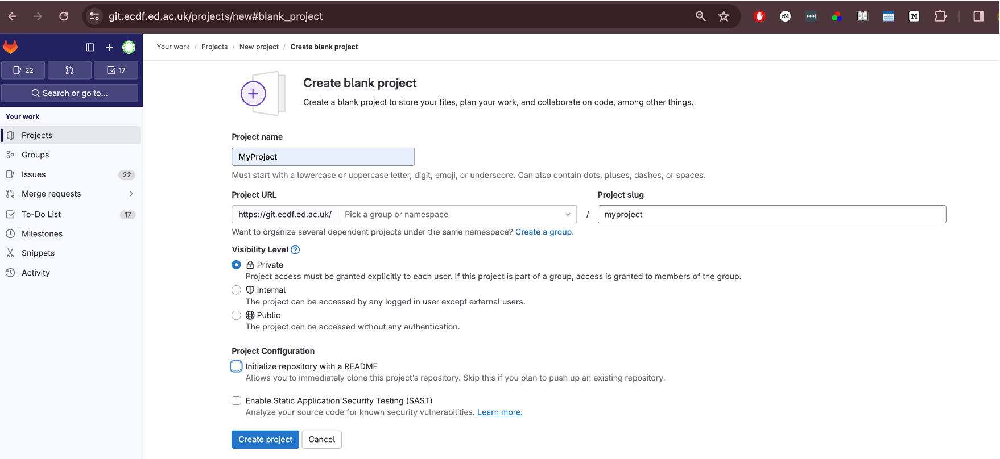
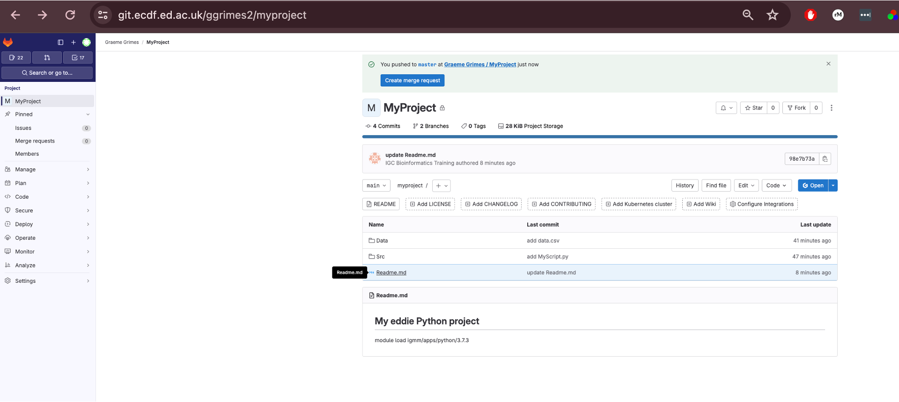
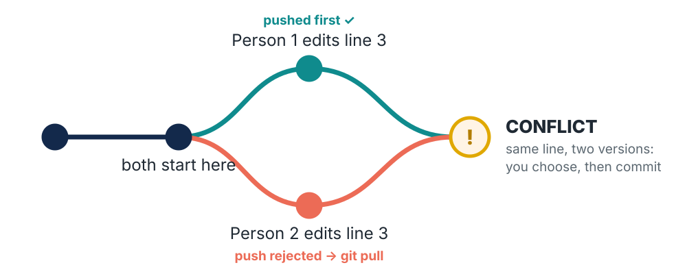
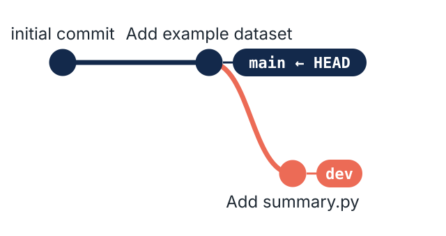
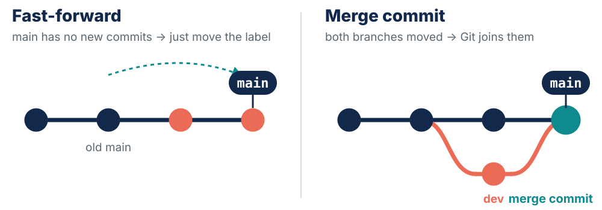

## {background-color="#13294b"}

::: {.email}
[**From:** Reviewer 2 · **To:** you · **Subject:** Manuscript GEN-2025-0417, revision]{.hdr}

Dear author,

The histogram in **Figure 3** looks different from the one in your preprint.

Please provide **the exact code and parameters** used to generate Figure 3 in the submitted version, and explain what changed.
:::

::: {.bigq .fragment style="color:#fff"}
You made Figure 3 fourteen months ago.\
Could you answer this email today?
:::

::: notes
**⏱ 09:00 · 3 min · HOOK**

**Say:** read the email aloud, slowly. Pause. Click to reveal the question. Let the silence sit; a few nervous laughs is the right reaction. Then: *"Hold that thought. By 2 o'clock you'll answer this email in about 30 seconds."*

**Do:** no welcome, no agenda yet. Open on the problem.

*Why:* gain attention and show relevance first (Gagné; Keller's ARCS).
:::

## How today works

:::: {.columns}
::: {.column width="55%"}
- I'm **Graeme**; helpers today: **[names]**
- **Mistakes are expected.** Git is built for *undo*.
- No question is too basic.
- We type **everything** together.
- **Break 10:30 · lunch 12:00 · finish 14:00**
:::
::: {.column width="45%"}
**Sticky notes**

[]{.sticky .green} **Yellow**: done / all good

[]{.sticky .red} **Pink**: stuck, please come over

<br>

::: {.muted .small}
Your Eddie login and GitLab SSH key were set up before today. Pink sticky now if either doesn't work.
:::
:::
::::

::: notes
**⏱ 09:03 · 3 min · BELONG**

**Say:** introduce yourself and each helper (they wave). *"Mistakes are expected. Git is built for undo, so you can't break anything we do today. If you're wondering something, someone else is too."* Point at the timetable.

**Do:** explain the stickies (yellow = done, pink = help; chosen because red and green are hard to tell apart for about 1 in 12 men) and get everyone to stick one on their laptop lid now. Ask for a pink sticky from anyone whose Eddie login or GitLab SSH key failed the pre-course check; a helper goes straight over.

**Watch for:** never say "just" or "simply" all day. For a beginner they turn a hard step into a personal failing.

*Why:* psychological safety (Edmondson); anxiety uses up working memory.
:::

## Open the Etherpad

:::: {.columns}
::: {.column width="55%"}
1. On your laptop, open the shared page:

[](){.small}

2. Answer each question **when the slides ask**: type an **x** to vote, or a few words

::: {.muted .small}
No account or name needed. Ask questions there any time too.
:::
:::
::: {.column width="45%"}
[]{.wooclap-qr}
:::
::::

[]{.etherpad-url .wooclap-embed-url}

::: notes
**⏱ 09:06 · 2 min**

**Do:** have the Etherpad open on your laptop in a second window, already filled in from `etherpad-questions.md`. Move on when most of the room has it open, not all of it.

**Say:** *"No account, no name needed. Keep the tab open: we'll use it a few times today, and you can type questions at the bottom whenever you like."*

**Watch for:** venue Wi-Fi. If the pad won't load, use hands up and fingers for the rest of the day. Someone deleting text by accident: the pad's history (clock icon) can restore it.
:::

## Where are you starting from? {.wooclap-poll}

[Answer on the Etherpad · Q1–Q2]{.wooclap-badge}

:::: {.columns}
::: {.column width="45%"}
::: {.poll}
**Q1.** How comfortable are you with the **command line**?

1 = never used it · 5 = live in it
:::
:::
::: {.column width="55%"}
::: {.poll}
**Q2.** How do you keep track of **versions** of your work *now*? (pick all that apply)

- Renamed copies: `_v2`, `_final`…
- Dropbox / OneDrive / SharePoint history
- Emailing files to myself or others
- Git (or another version control system)
- I don't, really
:::
:::
::::

::: notes
**⏱ 09:08 · 2 min · ACTIVATE**

**Do:** point at Q1 and Q2 on the pad; give about 80 seconds for both. Don't show the pad on this slide.

**Say:** *"There are no wrong answers: this is for me, so I know how fast to go."*

*Why:* bringing back what people already know (Ambrose et al.) and being asked before being taught (the pretesting effect, Richland et al.) both help new material stick. Q1 comes back as Q8 at the end.
:::

## Etherpad Q1–Q2 · live {.wooclap-live}

[]{.wooclap-embed}

::: notes
**⏱ 09:10 · 1 min**

**Say:** read the Q2 spread. Expect "renamed copies" to win. *"That's what I did for years. Let's see how well it works."*

**Do:** glance at Q1. Lots of 1s and 2s → slow down on the next slide and send helpers to the people who look unsure.
:::

## Your terminal toolkit {.toolkit}

Log in to Eddie and get an interactive node: `ssh <UUN>@eddie.ecdf.ed.ac.uk`, then `qlogin`

| Command | What it does |
|:--|:--|
| `pwd` | **where am I?** prints the folder you're in |
| `ls -l` | **list** the files here, with sizes and dates |
| `cd MyFolder` · `cd ~` | **change** folder · `~` is your home folder |
| `mkdir Data` | **make** a new folder |
| `cp -r source destination` | **copy** (`-r` = include everything inside a folder) |
| `cat notes.txt` | **show** what's in a file |
| `nano notes.txt` | **edit** a file · save: `Ctrl+O`, `Enter` · exit: `Ctrl+X` |
| `echo "hi" > a.txt` · `>> a.txt` | **write** text to a file: `>` replaces it, `>>` adds to the end |

::: {.muted .small}
**Tab** completes file names · **↑** brings back your last command · stuck in a screen? press **q**
:::

::: notes
**⏱ 09:11 · 3 min**

**Say:** *"These are the only shell commands we use today. You don't need to memorise them: this slide is on the website, and you can come back to it."*

**Do:** live demo in about 60 seconds, narrating each: `pwd`, `ls -l`, `cd ~`, `cat` a file. Show Tab completion once (people love it). Mention ↑ for the last command and q to escape.

**Watch for:** anyone still on the Eddie login node: they should have run `qlogin`.

**If behind:** skip the demo; point at the slide and move on.
:::

## Your turn: be the detective {.exercise}

::: {.task time="6"}
In pairs. Copy a colleague's project to your home folder and look around:

```bash
cp -r /messy_project ~/
cd ~/messy_project
ls -l
cat notes_old.txt
```

1. Which script made `figure3.png`?
2. What **changed** compared with the version before it?
3. **How sure are you?** Could you prove it to Reviewer 2?

::: {.small .muted}
Hint: `diff analysis_v2.py analysis_final.py` shows the lines that differ between two files.
:::
:::

::: notes
**⏱ 09:14 · 6 min · PRODUCTIVE STRUGGLE**

**Say:** *"In pairs. This is designed to be frustrating: there isn't a clean answer, and that's the point."* Start the timer.

**Do:** walk the room; don't rescue people. Ask *"How sure are you? Would that convince a reviewer?"*

**The trap:** `figure3.png` is dated 2 May (it was copied to a shared drive later), after every script, so the dates don't help. `notes_old.txt` says to use the FIXED script, but the FIXED script has its `savefig` line commented out. `diff` shows *what* differs between two files, never *which one made the figure*. Most pairs end up torn between `analysis_final.py` and `analysis_final_FIXED.py`.

**Watch for:** `cp: cannot stat`: a typo in the long path. Copy it from the lesson website.

*Why:* struggling first prepares people to learn from the explanation (Kapur; Schwartz & Bransford).

**Full answer and background:** `instructor-answers.md`, section "The two practice folders".
:::

## What made that hard? {.wooclap-poll}

[Answer on the Etherpad · Q3]{.wooclap-badge}

::: {.poll}
**Q3.** In one or two words: what made that hard?
:::

::: {.fragment}
Best guess: `analysis_final.py`, with the threshold lowered from 30 to 20 and a log scale added.\
**But nothing in that folder can *prove* it.**
:::

::: notes
**⏱ 09:20 · 2 min**

**Do:** point at Q3 on the pad. After about 45 seconds, click to reveal the best guess.

**Say:** *"Best guess: analysis_final.py, threshold 30 → 20, plus a log scale. But nothing in that folder can prove it."* Let that land: it's the case for everything that follows.
:::

## Etherpad Q3 · live {.wooclap-live}

[]{.wooclap-embed}

::: notes
**⏱ 09:22 · 1 min**

**Say:** read out four or five words from the cloud (expect: dates, names, notes, guessing, "which is final?"). *"Remember these words: they're our shopping list for a tool."*
:::

## So we need a tool that… {.needs}

| You said… | So we need… | Git's answer |
|:--|:--|:--|
| "which one is final?" | **one** file, with its whole history | commits |
| "dates were wrong" | a **record** of when and who | `git log` |
| "couldn't see what changed" | **exact differences** between versions | `git diff` |
| "notes didn't match" | a **message** attached to every change | commit messages |
| "can't prove it" | a fixed label on **the submitted version** | tags |

::: {.muted .small}
That's version control: a dated, permanent **lab book for code**.
:::

::: notes
**⏱ 09:23 · 2 min**

**Say:** go row by row, using the room's own Q3 words where they differ from the left column. *"Every one of these has a Git answer. That's version control: a dated, permanent lab book for code."*

**Do:** don't explain the Git commands yet; just name them. Each one gets taught properly later today.

*Why:* people remember explanations they helped to generate (the generation effect).
:::

## Today

::: {.journey}
[**Why Git**<br>the detective]{.stop .done}
[**First commit**<br>on Eddie]{.stop .here}
[**Recording**<br>changes]{.stop}
[**GitLab**<br>backup & sync]{.stop}
[**History**<br>& undo]{.stop}
[**Ignoring**<br>& big data]{.stop}
[**Tags**<br>answer Reviewer 2]{.stop}
:::

::: {.outcomes}
By **14:00** you will be able to:

- **record** your work as commits, and see exactly what changed
- **back up** a project on the University GitLab and keep two copies in sync
- **go back** to any version, and undo mistakes safely
- keep **big data and secrets** out of your repository
- **tag** the exact version behind a paper
:::

::: notes
**⏱ 09:25 · 2 min · MAP**

**Say:** read the outcomes. *"This strip comes back at the start of every section, so you always know where we are."* Say the break times out loud.

**Say also:** what's *not* covered today: working with colleagues in one repository, branches, Git in RStudio. They're on the website, and on the last slide.

*Why:* stating objectives and giving an advance organiser (Gagné; Ausubel) reduces the load of keeping track.
:::

## Your goal for today {.wooclap-poll}

[Answer on the Etherpad · Q4]{.wooclap-badge}

::: {.poll}
**Q4.** What's **one thing** you want to be able to do with Git by 2 pm? A real project of yours is ideal.
:::

::: {.muted .small}
We'll look back at these at the end.
:::

::: notes
**⏱ 09:27 · 1 min**

**Do:** point at Q4 on the pad. Don't wait for everyone; it stays open.

**Say:** *"A real project of yours is ideal: we'll check back at 2 o'clock."*

**Do at the break:** skim the answers. If many mention a thesis, a supervisor or a specific pipeline, use those as your examples for the rest of the day.
:::

## How Git thinks {auto-animate="true"}

::: {.flow}
[Working directory [README.md]{.filechip data-id="file"}]{.box data-id="wd"}
[`git add` →]{.arrow data-id="a1"}
[Staging area [README.md]{.filechip .ghost}]{.box .teal data-id="st"}
[`git commit` →]{.arrow data-id="a2"}
[Repository [README.md]{.filechip .ghost}]{.box .coral data-id="repo"}
:::

Like a **lab book**: first you do the work on the bench…

::: notes
**⏱ 09:28 · 4 min across three slides · MODEL**

**Say:** *"Think of a lab book. First you do the work on the bench: that's the working directory, the files you edit."*

*Why:* concrete analogy first, then the diagram, then the commands (concreteness fading). A working mental model is the most useful thing an intro can give a beginner.
:::

## How Git thinks {auto-animate="true"}

::: {.flow}
[Working directory [README.md]{.filechip .ghost}]{.box data-id="wd"}
[`git add` →]{.arrow data-id="a1"}
[Staging area [README.md]{.filechip .staged data-id="file"}]{.box .teal data-id="st"}
[`git commit` →]{.arrow data-id="a2"}
[Repository [README.md]{.filechip .ghost}]{.box .coral data-id="repo"}
:::

…then you **choose** what goes on today's page…

::: notes
**Say:** *"Then you choose what goes on today's page. That's the staging area, and `git add` is how you choose."* Emphasise **choose**: it's what the next question tests.
:::

## How Git thinks {auto-animate="true"}

::: {.flow}
[Working directory [README.md]{.filechip .ghost}]{.box data-id="wd"}
[`git add` →]{.arrow data-id="a1"}
[Staging area [README.md]{.filechip .ghost}]{.box .teal data-id="st"}
[`git commit` →]{.arrow data-id="a2"}
[Repository [README.md]{.filechip .committed data-id="file"}]{.box .coral data-id="repo"}
:::

…and **sign and date** the page. It's permanent.

- **Working directory**: the files you edit
- **Staging area**: what you've chosen for the next snapshot
- **Repository**: every snapshot (**commit**), forever

::: notes
**Say:** *"Then you sign and date the page with `git commit`. It's permanent."* Read the three definitions.

**Do:** ask *"Any questions about the three boxes?"* and wait 5 seconds. Then go straight to the question.
:::

## Check your model {.wooclap-poll}

[Vote with your fingers · Q5]{.wooclap-badge}

[Vote 1: on your own · hold up 1–4 fingers on 3]{.pi-step}

You edit **two** files, `a.py` and `b.py`. Then you run:

```bash
git add a.py
git commit -m "Fix plotting bug"
```

::: {.options}
What's in the commit?

1. Changes to both `a.py` and `b.py`
2. Only the changes to `a.py`
3. Nothing: you have to add both files first
4. Only the changes to `b.py`
:::

::: notes
**⏱ 09:32 · 2 min · PEER INSTRUCTION, VOTE 1**

**Do:** give 30 seconds' thinking time, no talking. Then *"1, 2, 3: show me"*: everyone holds up 1–4 fingers at once, so nobody copies. Note the rough split; **don't say which is right.** (Not on the pad: everyone would see the first votes.)

**What the wrong answers mean:** 1 = "a commit saves everything" (hasn't got staging yet) · 3 = "Git is all or nothing" · 4 = confused about what `add` does.

**If over ~80% are right:** skip the discussion and go straight to the answer slide.

*Why:* peer instruction (Crouch & Mazur; Smith et al. 2009).
:::

## Talk to your neighbour {.wooclap-poll}

[Vote with your fingers · Q6]{.wooclap-badge}

[Convince your neighbour]{.pi-step .talk}

You edit `a.py` and `b.py`, then run `git add a.py` and `git commit`.

::: {.bigq}
What's in the commit?
:::

::: {.muted .small}
1 minute: find someone who voted differently and convince them. Then **vote again** with your fingers (Q6).
:::

::: notes
**⏱ 09:34 · 3 min · VOTE 2**

**Say:** *"Find someone who voted differently and convince them. One minute."* Then *"1, 2, 3: show me"* again.

**Do:** compare with vote 1 out loud: *"Lots of 1s and 3s before, mostly 2s now."* The shift is the payoff: point it out. Ask someone who changed their mind what convinced them.

**Watch for:** pairs who agree straight away. Ask them to explain *why* to each other anyway.

*Why:* correct answers rise after discussion even in pairs where neither person was right at first (Smith et al. 2009). The talking does the teaching.
:::

## Answer: 2, only `a.py`

::: {.flow}
[Working directory [b.py (still modified)]{.filechip}]{.box}
[`git add a.py` →]{.arrow}
[Staging area [a.py]{.filechip .staged}]{.box .teal}
[`git commit` →]{.arrow}
[Repository [a.py]{.filechip .committed}]{.box .coral}
:::

A commit contains **exactly what's staged**: no more, no less. `b.py` is still waiting in the working directory.

::: {.muted .small}
That's a feature: one commit = one logical change, even if you've touched five files. (`-m "…"` is the commit's **message**: we'll type our own in a few minutes.)
:::

::: notes
**⏱ 09:37 · 1 min**

**Say:** explain with the same three boxes. *"A commit is exactly what's staged, no more, no less. b.py is still waiting on the bench."* Then: *"That's a feature: one commit is one logical change, even if you've touched five files."*
:::

## Tell Git who you are

```{.bash code-line-numbers="|1|2|3|4"}
git config --global user.name "Your Name"
git config --global user.email "you@ed.ac.uk"
git config --global init.defaultBranch main
git config --global core.editor "nano -w"
```

Every commit is **signed** with this name and email, just like a lab book page.

::: {.newcmds}
`git config --global` · a setting for **every** repository you make on this machine (do it once)\
`init.defaultBranch main` · your project's line of history will be called **main**\
`core.editor "nano -w"` · if Git ever needs you to type text, it opens `nano` (save `Ctrl+O` `Enter`, exit `Ctrl+X`)
:::

::: notes
**⏱ 09:38 · 3 min**

**Do:** step through the lines with the arrow key; everyone types along. Wait for the room before each next line.

**Say:** *"Once per machine. Your name and email go on every commit, like signing a lab book page."*

**Watch for:** typos in the email address: `git config --global --list` shows what's set. Use the same email as your GitLab account so commits link to you there.

*Why only these?* Just-in-time setup: the editor setting stops a stray vim session costing 10 minutes; `pull.rebase` waits until just before the first pull.
:::

## First commit: start tracking

[Step 1 of 4 · set up]{.step}

```bash
mkdir ~/MyProject
cd ~/MyProject
git init
git status
```

```{.output}
Initialized empty Git repository in /home/<UUN>/MyProject/.git/
On branch main
No commits yet
nothing to commit (create/copy files and use "git add" to track)
```

::: {.newcmds}
`git init` · turn this folder into a **repository**: Git creates a hidden `.git` folder where all history will live (see it with `ls -a`)\
`git status` · ask Git **what it sees right now**. Run it all the time: it also tells you what to do next
:::

::: notes
**⏱ 09:41 · 2 min · WIN (step 1 of 4)**

**Do:** live-code at typing speed; everyone types along. Run `ls -a` to show the hidden `.git` folder.

**Say:** *"`git status` is the command to run whenever you're unsure. It tells you what Git sees, and usually what to do next."*

**Watch for:** anyone who ran `git init` in their home folder (their prompt or `pwd` says `/home/<UUN>`). Fix: `rm -rf ~/.git`, then `cd ~/MyProject` and run `git init` again.

**Note:** MyProject is the one repository we use all morning.
:::

## First commit: make a change

[Step 2 of 4 · make a change]{.step}

```bash
echo "# My eddie Python project" > README.md
```

[Predict]{.predict} What will `git status` say now?

::: {.fragment}
```bash
git status
```

```{.output}
Untracked files:
  (use "git add <file>..." to include in what will be committed)
        README.md
```

Git **sees** the file but isn't tracking it yet: it's still on the bench (working directory).
:::

::: notes
**⏱ 09:43 · 2 min · step 2 of 4**

**Do:** everyone runs the `echo` line. **Before** clicking, ask pairs to predict what `git status` will say and get one or two guesses out loud. Then reveal, and everyone runs it.

**Say:** *"Untracked: Git can see the file but isn't looking after it yet. It's still on the bench."*

*Why:* making a prediction turns watching into recalling, and wrong predictions are where the learning is.
:::

## First commit: stage it

[Step 3 of 4 · choose what goes in the snapshot]{.step}

```bash
git add README.md
git status
```

```{.output}
Changes to be committed:
  (use "git rm --cached <file>..." to unstage)
        new file:   README.md
```

::: {.flow .compact}
[Working directory]{.box}
[`git add` →]{.arrow}
[Staging area [README.md]{.filechip .staged}]{.box .teal}
[→]{.arrow}
[Repository]{.box .coral}
:::

::: {.newcmds}
`git add <file>` · put a file's current state into the **staging area**, ready for the next commit
:::

::: notes
**⏱ 09:45 · 2 min · step 3 of 4**

**Say:** point at the diagram. *"git add put README.md in the staging area: it's on today's page, but not signed yet."* Read the `git status` output together: *"Changes to be committed"*.

**Watch for:** `fatal: pathspec 'README.md' did not match any files`: they're in the wrong folder or typed a different name. `pwd`, then `ls`.
:::

## First commit: save the snapshot

[Step 4 of 4 · commit]{.step}

```bash
git commit -m "initial commit"
```

```{.output}
[main (root-commit) 72041c0] initial commit
 1 file changed, 1 insertion(+)
 create mode 100644 README.md
```

::: {.newcmds}
`git commit -m "message"` · save everything that's staged as a permanent **snapshot**, with a message saying why. (Forget `-m` and Git opens `nano` for you to type it.)
:::

::: {.bigq}
Green sticky up when you see this. 🎉
:::

::: notes
**⏱ 09:47 · 3 min · step 4 of 4**

**Say:** *"The bit in square brackets, 72041c0, is this commit's ID: its hash. Everyone's will be different."*

**Do:** count the yellow stickies out loud and celebrate. Aim to be here by about 09:50.

**Watch for:** someone who forgot `-m` ends up in nano: type a message, then `Ctrl+O`, Enter, `Ctrl+X`. Anyone with "Please tell me who you are" skipped the config slide.

*Why:* an early success makes people expect to succeed, which drives motivation for the rest of the day (Eccles).
:::

# Recording Changes {.section-slide background-color="#13294b"}

::: {.journey}
[**Why Git**]{.stop .done}
[**First commit**]{.stop .done}
[**Recording**<br>changes]{.stop .here}
[**GitLab**]{.stop}
[**History**]{.stop}
[**Ignoring**]{.stop}
[**Tags**]{.stop}
:::

[How do I record what changed, and see the difference?]{.ep-q}

::: notes
**⏱ 09:50 · section runs to 10:30**

**Say:** *"We've made one snapshot. Now: making changes, and seeing exactly what changed. That's the 'couldn't see what changed' problem from the detective task."*
:::

## Look at the history

```bash
git log
```

```{.output}
commit 72041c0b39884a9bf978bc272c82d862976abcb (HEAD -> main)
Author: Your Name <you@ed.ac.uk>
Date:   Tue Sep 24 10:06:58 2024 +0100

    initial commit
```

::: {.newcmds}
`git log` · the history: **who**, **when**, **what** (message), newest first. Long list? Space for more, **q** to quit\
`git log --oneline` · the same, one line per commit\
`HEAD` · a pointer to **where you are** in the history (usually the latest commit)
:::

::: notes
**⏱ 09:51 · 4 min**

**Do:** run `git log`, then `git log --oneline`. Point at the author, date and message.

**Say:** *"Who, when, what. That's the 'dates were wrong' problem from the detective task, solved."* *"HEAD is 'you are here' in the history."*

**Watch for:** a long log fills the screen and people think the terminal has frozen: press **q**.
:::

## Make a change

Open the file in `nano` and add two lines (save: `Ctrl+O` `Enter` · exit: `Ctrl+X`):

```bash
nano README.md
```

```
# My eddie Python project

To run Python on eddie need to run:
module load igmm/apps/python/3.12.3
```

```bash
git status
```

```{.output}
Changes not staged for commit:
    modified:   README.md
```

::: notes
**⏱ 09:55 · 4 min**

**Do:** open nano and add the two lines slowly. **Say the keys out loud:** Ctrl+O, Enter to save; Ctrl+X to exit. Then `git status`.

**Say:** *"Modified: Git knows this file and has noticed it changed since the last snapshot."*

**Watch for:** people who exit nano without saving (nothing shows as modified), or who are stuck at nano's "File Name to Write" prompt (press Enter).
:::

## What changed? `git diff`

```bash
git diff README.md
```

```diff
diff --git a/README.md b/README.md
index a4c6c69..603f621 100644
--- a/README.md
+++ b/README.md
@@ -1 +1,4 @@
 # My eddie Python project
+
+To run Python on eddie need to run:
+module load igmm/apps/python/3.12.3
```

::: {.newcmds}
`git diff <file>` · show **exactly** what changed since you last staged or committed: **`+`** added · **`-`** removed · leading space = unchanged
:::

::: notes
**⏱ 09:59 · 5 min**

**Say:** *"This is the 'couldn't see what changed' problem, solved: exact lines, + added, − removed."* Only explain the + and − lines; the header lines are for reference.

**Do:** get everyone into the habit: **always `git diff` before `git add`**. It catches accidental edits and leftover debugging lines.

**Watch for:** an empty `git diff`: they already staged the file. `git diff --staged` shows it.
:::

## Stage, commit, compare

```bash
git add README.md
git commit -m "Describe how to run Python on eddie"
git diff HEAD~1 README.md     # compare with one commit ago
```

`HEAD~1` = **one commit before** `HEAD` · `HEAD~2` = two before, and so on.

| Command | Compares |
|:--|:--|
| `git diff` | working directory ↔ staging area |
| `git diff --staged` | staging area ↔ last commit |
| `git diff HEAD` | working directory ↔ last commit |
| `git diff HEAD~1` | now ↔ one commit ago |

::: notes
**⏱ 10:04 · 5 min**

**Do:** everyone runs the add and commit, then `git diff HEAD~1 README.md`.

**Say:** map the table onto the three boxes: *"`git diff` = bench vs today's page. `--staged` = today's page vs the last signed page."* Don't drill the table: Q7 just before lunch asks about `git diff HEAD`, as spaced recall.
:::

## Undoing changes

```bash
git restore README.md           # throw away edits you haven't staged
git restore --staged README.md  # take it out of staging, keep the edits
```

::: {.newcmds}
`git restore <file>` · put the file back to how it was at the last commit\
`git restore --staged <file>` · undo a `git add`
:::

⚠️ `git restore` **permanently** discards edits that were never staged or committed. Try it on a test edit, not real work.

::: notes
**⏱ 10:09 · 4 min**

**Do:** demo on a throwaway edit: add a silly line to README.md, `git restore README.md`, then `cat README.md`. It's gone.

**Say:** *"This is the one place Git can lose your work: edits you never committed. Anything you've committed can always be got back. We'll see how after the break."*
:::

## Directories and data

Git tracks **files**, not empty directories:

```bash
mkdir Src
touch Src/.gitkeep          # an empty placeholder file, so Git keeps the folder
git add Src/.gitkeep
```

Add a small dataset (copy it in and give it a shorter name):

```bash
mkdir Data
cp /combined_tidy_vcf.csv Data/data.csv
git add Data/data.csv
git commit -m "Add Src folder and example dataset"
```

::: {.newcmds}
`touch <file>` · create an empty file · names starting with `.` are hidden from plain `ls`\
`cp <from> <to>` · copy a file; giving a new name at the end renames the copy
:::

::: {.muted .small}
Small, stable data is fine to commit. Large or sensitive data: after lunch.
:::

::: notes
**⏱ 10:13 · 6 min**

**Say:** *"Git tracks files, not folders. An empty folder is invisible to it, so we put a placeholder file inside."*

**Do:** everyone types along. Use the copy button on the website for the long `cp` path. Then `git status` and `git log --oneline` to check.

**Watch for:** `cp: cannot stat`: a typo in the path. Copy it from the website. Mention: *"Small, stable data is fine. Big data is after lunch; it matters a lot on Eddie."*
:::

## Your turn: a Python script {.exercise}

::: {.task time="10"}
1. Create `Src/hello.py` with `nano Src/hello.py`, then add and commit it:

```python
#!/usr/bin/env python
print("Hello World!")
```

2. Change it to read the CSV and print the number of rows. Check `git diff` before you commit.
:::

::: {.answer .fragment}
```python
#!/usr/bin/env python
import pandas as pd

variants = pd.read_csv("Data/data.csv")
print(len(variants))
```

`git diff Src/hello.py` → `git add Src/hello.py` → `git commit -m "Read CSV and report row count"`
:::

::: notes
**⏱ 10:19 · 10 min**

**Do:** start the timer and walk the room. Running the script isn't required; the Git steps are the point.

**Watch for:** people who commit without `git add` ("nothing added to commit"), or who try `git add` from the wrong folder (`pwd` should end in MyProject).

**Fast finishers:** `git log --oneline`: there should be 5 commits. Then `git log -p Src/hello.py`.

**If behind:** stop at step 1; reveal the answer and do step 2 together.
:::

## Break {.breakslide background-color="#13294b"}

::: {.bigq}
Back at **10:45**
:::

::: {.muted style="color:#bfe6e6"}
Leave your Eddie terminal open. Next: backing up to GitLab.
:::

::: notes
**⏱ 10:30–10:45 · BREAK**

**Do:** skim the Q4 goals. Fix any pink stickies with helpers. Check that the GitLab login works on the presenter laptop, and have your own GitLab project page open ready.
:::

# GitLab {.section-slide background-color="#0f8b8d"}

::: {.journey}
[**Why Git**]{.stop .done}
[**First commit**]{.stop .done}
[**Recording**]{.stop .done}
[**GitLab**<br>backup & sync]{.stop .here}
[**History**]{.stop}
[**Ignoring**]{.stop}
[**Tags**]{.stop}
:::

[How do I back up my repository and keep two copies in sync?]{.ep-q}

::: notes
**⏱ 10:45 · section runs to 11:30**

**Say:** *"So far everything lives in one folder on Eddie. Now: a backup, and a second copy kept in sync."*

**Do:** start with a 30-second recall: *"Tell your neighbour the three steps to save a snapshot."* (Edit, add, commit.)

**Watch for:** the SSH step is where people get stuck. Brief helpers to fan out at that slide.
:::

## What is a remote?

:::: {.columns}
::: {.column width="55%"}
A **remote** is a saved link to another copy of your repository on a server.

- **Back up**: Eddie's scratch space isn't forever
- **Sync**: laptop ↔ Eddie ↔ work PC
- **Share** with your supervisor, or the world

**University GitLab**: <https://git.ecdf.ed.ac.uk>
:::
::: {.column width="45%"}
::: {.flow style="flex-direction:column"}
[Remote (GitLab)]{.box .teal}
[`git push` ↑ &nbsp; ↓ `git pull`]{.arrow}
[Local (Eddie)]{.box}
:::
:::
::::

::: notes
**⏱ 10:46 · 3 min**

**Say:** *"A remote is just another copy of your repository, with all the history, on a server. GitLab isn't 'the real one'; it's the copy you agree to sync through."* Connect the dots: backup (Eddie's scratch space is not forever), sync, share.

**Callback:** *"A backup Reviewer 2 can't make you lose."*
:::

## Create a GitLab project

:::: {.columns}
::: {.column width="55%"}
{fig-alt="GitLab Create blank project form with Project name MyProject and Initialize repository with a README unticked."}
:::
::: {.column width="45%"}
1. Log in to <https://git.ecdf.ed.ac.uk>
2. **New project** → **Create blank project**
3. Project name: **MyProject**
4. **Untick** *Initialize repository with a README*
5. **Create project**
:::
::::

::: notes
**⏱ 10:49 · 4 min**

**Do:** do it on screen, step by step; everyone follows.

**Say:** stress step 4: **untick** "Initialize repository with a README".

**Watch for:** if they left it ticked, their first push is rejected because GitLab already has a commit they don't. Fix: `git pull --allow-unrelated-histories`, save the merge message, then push.
:::

## SSH keys: password-less access

Set up before today? Just run the test on the right. Otherwise, do it now:

:::: {.columns}
::: {.column width="55%"}
```bash
ssh-keygen -t ed25519
cat ~/.ssh/id_ed25519.pub
```

- **Enter** to accept the file location, then choose a **passphrase** (typing is invisible)
- `id_ed25519`: **private** key. Never share it!
- `id_ed25519.pub`: **public** key. Copy the one line that `cat` shows
:::
::: {.column width="45%"}
In GitLab:

1. [User icon > Preferences]{.menu}
2. [Access > SSH Keys]{.menu}
3. [Add new key]{.menu}, paste, **Add key**

Then test it:

```bash
ssh -T git@git.ecdf.ed.ac.uk
```

First time it asks *"continue connecting?"*: type **yes**. Success = *"Welcome to GitLab"*.
:::
::::

::: notes
**⏱ 10:53 · 4 min if the key was set up before the day (up to 12 if not) · the old bottleneck**

**Do first:** everyone runs `ssh -T git@git.ecdf.ed.ac.uk`. Anyone who sees "Welcome to GitLab" puts up a yellow sticky and moves on. Only people without a working key do the steps below, with a helper.

**Say:** *"Think of the public key as a padlock you hand out, and the private key as the only key that opens it. GitLab gets the padlock."*

**Do:** go slowly. After `cat`, show exactly which line to copy (it starts with `ssh-ed25519`). Add the key in GitLab on screen. Everyone runs `ssh -T`; yellow sticky when they see "Welcome to GitLab".

**Watch for:**
- they already have a key → ssh-keygen asks to overwrite: answer **n** and use the existing `.pub`
- "Permission denied (publickey)" → they pasted the private key, or only part of the line
- the passphrase seems not to type: it's invisible on purpose

**If behind:** helpers take the stragglers; carry on with everyone else.
:::

## Connect and push

Back in `~/MyProject`. Copy *your* project's address from GitLab: [Code > Clone with SSH]{.menu}

```{.bash code-line-numbers="|1|2|3"}
git remote add origin git@git.ecdf.ed.ac.uk:<username>/myproject.git
git remote -v
git push -u origin main
```

::: {.newcmds}
`git remote add origin <address>` · save GitLab's address under the short name **origin**\
`git remote -v` · check which address(es) are saved\
`git push -u origin main` · send your commits to GitLab. `-u` remembers the link, so next time plain `git push` works
:::

::: notes
**⏱ 10:57 · 6 min**

**Do:** show where to copy the address on GitLab (Code → Clone with SSH). Step through the three lines.

**Say:** *"`origin` is just a nickname for that long address. `-u` means 'remember this link', so next time it's plain `git push`."*

**Watch for:** a typo in the address → `git remote set-url origin <correct-address>`. "error: src refspec main does not match any" → they have no commits yet (wrong folder?).
:::

## Pushed!

{.r-stretch fig-align="center" fig-alt="MyProject page on GitLab after pushing, listing the Data and Src folders and the README file."}

::: notes
**⏱ 11:03 · 1 min**

**Do:** everyone refreshes their GitLab project page. Click into the commit history to show it matches `git log`. Point out that the README renders as a formatted page. Yellow stickies.
:::

## A second computer

Pretend your **laptop** is another folder on Eddie:

```{.bash code-line-numbers="|1|2|3-4"}
git config --global pull.rebase false
git clone git@git.ecdf.ed.ac.uk:<username>/myproject.git ~/MyProject-laptop
cd ~/MyProject-laptop
git log --oneline
```

::: {.newcmds}
`git clone <address> <folder>` · download a **complete copy**: every file, all the history, and `origin` already set up\
`pull.rebase false` · when you `git pull`, **merge** the two histories together (the simplest option)
:::

::: {.flow .compact}
[MyProject<br>"Eddie"]{.box}
[push ↑ pull ↓]{.arrow}
[GitLab]{.box .teal}
[push ↑ pull ↓]{.arrow}
[MyProject-laptop<br>"laptop"]{.box .coral}
:::

::: notes
**⏱ 11:04 · 5 min**

**Say:** *"Most of us have a laptop and Eddie. We'll fake that with a second folder."*

**Do:** line 1 first: *"When you pull, merge. It's the simplest behaviour, and without it newer Git refuses to pull in the exact situation we're about to create."* Then clone and `git log --oneline`: *"Same history, all of it. That's what a clone is."*

**Watch for:** cloning *inside* MyProject. The target `~/MyProject-laptop` keeps it in the home folder.
:::

## Pull, fetch and rejected pushes

::: {.newcmds}
`git pull` · download new commits from GitLab **and merge** them into your files\
`git fetch` · only download them, don't touch your files yet (`git pull` = fetch + merge)
:::

If the other copy pushed first, your push is refused:

```{.output}
! [rejected]   main -> main (non-fast-forward)
```

Your copy is **behind** → `git pull`, then `git push` again. Not an error in your work.

::: {.muted .small}
If `git pull` opens `nano` with *"Merge branch 'main'…"*: that's the merge's message. Save and exit: `Ctrl+O` `Enter` `Ctrl+X`.
:::

::: notes
**⏱ 11:09 · 4 min**

**Say:** *"`git pull` brings the other copy's commits into yours. A rejected push isn't an error in your work: the other copy simply pushed first. Pull, then push again."*

**Do:** point at the nano note: everyone will meet that merge message in the exercise, so read it out now.
:::

## Your turn: keep two copies in sync {.exercise}

::: {.task time="12"}
Switch copies with `cd ~/MyProject-laptop` or `cd ~/MyProject` (check with `pwd`).

1. **laptop**: `nano README.md`, add a `## Data` heading → `add`, `commit`, `push`
2. **MyProject**: `git pull` → is the heading there? (`cat README.md`)
3. **MyProject**: `echo "todo" > notes.txt` → `add`, `commit`, `push`
4. **laptop**, *without pulling*: `nano Src/hello.py`, change a line → `add`, `commit`, `push`. What happens? Fix it.
:::

::: {.answer .fragment}
Step 4 is **rejected**: the laptop copy is behind. `git pull` (Git merges the two changes automatically, since they're in different files), then `git push`.\
**Always pull before you start work.**
:::

::: notes
**⏱ 11:13 · 14 min**

**Do:** start the timer. Remind people: `pwd` tells you which copy you're in.

**Expected path:** step 4 is rejected → `git pull` → nano opens with "Merge branch 'main'…" → save and exit → `git push` works. Different files, so Git merges automatically.

**Watch for:**
- working in the wrong copy (the most common problem): `pwd`
- forgetting to push at step 1 or 3, so the other copy has nothing to pull
- "fatal: Need to specify how to reconcile divergent branches" → they skipped the `pull.rebase` line

**Fast finishers:** edit the **same line** of README.md in both copies to cause a conflict (next slide).
:::

## Same line, two versions: a conflict

{.diagram fig-align="center" fig-alt="Commit graph: two copies start from the same commit and change the same line; the second push is rejected and git pull reports a conflict."}

Edit the file, keep what you want, **delete the `<<<<<<<` `=======` `>>>>>>>` markers**, then `add` → `commit` → `push`.

::: notes
**⏱ 11:27 · 3 min, concept only**

**Say:** *"Git merges changes to different lines by itself. Only the same line changed two ways needs you to decide. It refuses to guess which version of your science is right."* Describe the markers: above `=======` is yours, below is the other copy's. Delete all three marker lines, keep what you want, then add, commit, push.

**Note:** working with colleagues in one repository is a follow-on topic. This is enough to recognise a conflict and not panic. If a fast finisher made one, resolve it live on their screen.
:::

## Fixing a conflict

:::: {.columns}
::: {.column width="55%"}
`git pull` stops with:

```{.output}
CONFLICT (content): Merge conflict in README.md
Automatic merge failed; fix conflicts and then commit the result.
```

`nano README.md` shows both versions:

```{.output}
# My eddie Python project

<<<<<<< HEAD
To run Python on Eddie, first run:
=======
To run Python on eddie you need:
>>>>>>> 4f2c1a9 (Reword README)
module load igmm/apps/python/3.12.3
```
:::
::: {.column width="45%" .small}
`<<<<<<< HEAD` · start of **your** version\
`=======` · divider\
`>>>>>>> 4f2c1a9` · end of the **incoming** version (from GitLab)

**To fix it:**

1. Keep yours, theirs, or a mix
2. **Delete all three marker lines**
3. `git add README.md`
4. `git commit` · nano opens: save and exit
5. `git push`

::: {.muted}
Back out instead: `git merge --abort`
:::
:::
::::

::: notes
**⏱ 11:29 · 2 min, concept only (runs slightly into History & Undo)**

**Say:** *"Git has put both versions in the file and marked them. Everything between the arrows and the equals signs is yours; everything after the equals signs is what came from GitLab. You decide what the line should say."*

**Do:** point at each marker in turn. Then show what the fixed file looks like: one line, no markers.

**Watch for:**
- markers left in the file and committed anyway: Git doesn't check. `grep -n '<<<<<<<' README.md` before `git add` finds any leftovers.
- `git status` during a conflict says *"both modified: README.md"* and *"You have unmerged paths"*: that's normal until you `add` and `commit`.

**Same in the branching bonus:** `git merge <branch>` gives exactly this when both branches changed the same line.
:::

# History & Undo {.section-slide background-color="#13294b"}

::: {.journey}
[**Why Git**]{.stop .done}
[**First commit**]{.stop .done}
[**Recording**]{.stop .done}
[**GitLab**]{.stop .done}
[**History**<br>& undo]{.stop .here}
[**Ignoring**]{.stop}
[**Tags**]{.stop}
:::

[How do I find old versions, and undo mistakes?]{.ep-q}

::: notes
**⏱ 11:30 · section runs to 11:55, lunch at 12:00**

**Do:** 1-minute recall: *"Tell your neighbour: why was your push rejected, and how did you fix it?"*

**Say:** *"Everyone back to the main copy and catch up first:"* `cd ~/MyProject`, then `git pull`.
:::

## Looking back

First, back to the main copy and catch up: `cd ~/MyProject` then `git pull`

```bash
git log --oneline --graph       # history, merges drawn as a graph
git log -p README.md            # every change ever made to one file
git show HEAD~2:README.md       # a file as it was two commits ago
git diff HEAD~2 HEAD README.md  # what changed since then
```

::: {.newcmds}
`--graph` · draw the merge from the sync exercise · `-p` · show each commit's changes, not just its message\
`git show <commit>:<file>` · print an old version of a file (nothing is changed) · `HEAD~2` = two commits before now
:::

::: notes
**⏱ 11:32 · 6 min**

**Do:** run all four commands. With `--graph`, point at the merge from the sync exercise.

**Say:** *"This is everything the detective task was missing: every version, with who, when and why. `git show` only prints the old version; nothing changes."*

**Watch for:** `HEAD~2` errors in a repository with fewer commits: use `HEAD~1`.
:::

## Oops! Undoing mistakes {.dense}

| Situation | Fix |
|:--|:--|
| Deleted or broke a file (not committed) | `git restore <file>` |
| Want a file back from an earlier commit | `git restore --source=HEAD~1 <file>` |
| Typo in the last commit message | `git commit --amend -m "Better message"` |
| A bad commit is **already pushed** | `git revert <hash>`: a *new* commit that undoes it |
| Half-done edits, but need to `git pull` | `git stash` → `git pull` → `git stash pop` |

::: {.warn}
**Golden rule:** only `--amend` commits you have **not pushed** yet. Once something is on GitLab, use `git revert`, which adds history instead of rewriting it.
:::

::: notes
**⏱ 11:38 · 6 min**

**Say:** walk through each row:
- `restore`: back to the last commit (or any earlier one with `--source`)
- `--amend`: *replaces* the last commit
- `revert`: a *new* commit that is the exact opposite of an old one; get the hash from `git log --oneline`
- `stash`: puts unfinished edits on a shelf; `stash pop` puts them back

Then the golden rule: *"Only amend what you haven't pushed. Once it's on GitLab, revert."*

**Note:** this is the slide people photograph. Give them a moment.
:::

## Your turn: undo it {.exercise}

::: {.task time="6"}
1. Add a silly line to `README.md` and commit it with the message `"oops"`.
2. Fix the message to `"Add silly line"` **without** a new commit.
3. Push, then undo the whole commit **safely**.
:::

::: {.answer .fragment}
```bash
git commit --amend -m "Add silly line"   # before pushing: rewrite is fine
git push
git revert HEAD --no-edit                # after pushing: add an undo commit
git push
```
`--no-edit` = use Git's automatic message (*Revert "Add silly line"*) instead of opening `nano`.
:::

::: notes
**⏱ 11:44 · 8 min**

**Do:** start the timer and walk the room.

**Watch for:**
- `--amend` without `-m` opens nano with the old message: edit it and save
- revert without `--no-edit` opens nano: save and exit
- someone who amends *after* pushing gets a rejected push: that's the golden rule in action. Talk them through it: `git pull`, then push.

**Check:** `git log --oneline` shows both "Add silly line" and 'Revert "Add silly line"'.
:::

## Your turn: `git diff HEAD` {.exercise}

[Answer on the Etherpad · Q7]{.wooclap-badge}

::: {.task time="2"}
What does `git diff HEAD` show?

a) working directory ↔ staging area
b) staging area ↔ last commit
c) working directory ↔ last commit
d) two different commits
:::

::: {.answer .fragment}
**c)**. Everything that has changed since the last commit, staged or not.
:::

::: notes
**⏱ 11:52 · 3 min · Q7, spaced recall**

**Do:** point at Q7 on the pad. Votes on their own, then reveal.

**Say:** *"`HEAD` = the last commit. So `git diff HEAD` = everything you've changed since then, staged or not."* This brings back the 09:50 material just before lunch. Any spare minutes before 12:00: take questions.
:::

## Lunch {.breakslide background-color="#13294b"}

::: {.bigq}
Back at **12:30**
:::

::: {.muted style="color:#bfe6e6"}
Next: keeping big data and secrets out, then answering Reviewer 2.
:::

::: notes
**⏱ 12:00–12:30 · LUNCH**

**Do:** minute cards: each person writes "one thing that's clear, one that's muddy" on a sticky as they leave. Read them over lunch and address the muddiest one at 12:30.
:::

# Ignoring Things {.section-slide background-color="#0f8b8d"}

::: {.journey}
[**Why Git**]{.stop .done}
[**First commit**]{.stop .done}
[**Recording**]{.stop .done}
[**GitLab**]{.stop .done}
[**History**]{.stop .done}
[**Ignoring**<br>& big data]{.stop .here}
[**Tags**]{.stop}
:::

[How do I keep big data and secrets out of my repository?]{.ep-q}

::: notes
**⏱ 12:30 · section runs to 12:51**

**Do:** first, 2 minutes on the muddiest point from the lunch stickies. Then a 1-minute recall: *"Tell your neighbour the difference between amend and revert."*

**Say:** *"Now: keeping things out of Git, which matters a lot on Eddie."*
:::

## `.gitignore`

Files you usually **don't** want to track:

- outputs you can regenerate
- temporary files from your editor or IDE
- large data or binary files
- anything **sensitive**: passwords, keys, patient data

:::: {.columns}
::: {.column width="50%"}
A file called **`.gitignore`** lists what Git should pretend not to see:

```bash
nano .gitignore
```

```
# a whole folder
results/
# any file ending in .dat
*.dat
# one file
.Rhistory
```
:::
::: {.column width="50%"}
`*` matches anything · a trailing `/` means a folder · lines starting with `#` are comments (only at the **start** of a line).

Commit `.gitignore` like any other file, so it's backed up and shared:

```bash
git add .gitignore
git commit -m "Ignore outputs and temporary files"
```
:::
::::

::: notes
**⏱ 12:33 · 5 min**

**Say:** *"`.gitignore` is a list of things for Git to pretend it can't see."* Explain the patterns: `*` matches anything, a trailing `/` means a folder.

**Watch for:** comments on the same line as a pattern don't work: `results/  # outputs` is read as one strange pattern. Comments go on their own line.

**Say:** *"Commit `.gitignore` itself, so every copy of the project ignores the same things."*
:::

## Large data on Eddie {.dense}

:::: {.columns}
::: {.column width="55%"}
- Git keeps **every version forever**: commit a 20 GB BAM once and it stays in `.git` even after you delete it
- GitLab has **size limits**: big pushes get rejected
- Commit the **scripts** and a README that says **where the data lives**
- Check how big your repository is: `du -sh .git`
:::
::: {.column width="45%"}
```
# .gitignore for genomics
*.bam
*.bai
*.cram
*.fastq.gz
*.vcf.gz
results/
work/
```
:::
::::

::: {.warn}
Already committed a big file? `git rm --cached big.bam` stops tracking it, but it's **still in the history**. Ask for help **before** you push.
:::

::: notes
**⏱ 12:38 · 6 min**

**Say:** *"This is the most common Git disaster on an HPC system. Commit a 20 GB BAM once and it's in the history forever, even after you delete it. GitLab will refuse the push."*

**Do:** everyone runs `du -sh .git` to see how small their repository is.

**Say:** *"Commit the scripts, and a README saying where the data lives. Set up `.gitignore` before your first commit, not after."*

**Note:** removing a file from history needs tools like `git filter-repo`, which is out of scope. Prevention is far easier. `work/` is Nextflow's work folder.
:::

## Your turn: ignore a secret {.exercise}

::: {.task time="5"}
1. Create `secret.txt` containing some text.
2. Add it to `.gitignore`.
3. Run `git status`. Is it listed?
4. Commit your `.gitignore` and push.
:::

::: {.answer .fragment}
```bash
echo "my password" > secret.txt
echo "secret.txt" >> .gitignore    # >> adds a line; > would wipe the file
git status        # secret.txt no longer appears
git add .gitignore
git commit -m "Ignore secret.txt"
git push
```
:::

::: notes
**⏱ 12:44 · 7 min**

**Do:** start the timer.

**Watch for:** using `>` instead of `>>` wipes the existing `.gitignore`: `cat .gitignore` to check. If `secret.txt` still shows in `git status`, they misspelled it in `.gitignore`.

**Say (debrief):** *"If you'd already committed secret.txt, .gitignore wouldn't help: it only affects files Git isn't tracking yet."*
:::

# Tags {.section-slide background-color="#13294b"}

::: {.journey}
[**Why Git**]{.stop .done}
[**First commit**]{.stop .done}
[**Recording**]{.stop .done}
[**GitLab**]{.stop .done}
[**History**]{.stop .done}
[**Ignoring**]{.stop .done}
[**Tags**<br>answer Reviewer 2]{.stop .here}
:::

[How do I mark the exact version behind a paper?]{.ep-q}

::: notes
**⏱ 12:52 · section runs to 13:13 · the payoff**

**Say:** *"Back to Reviewer 2. The last piece: a permanent label on the exact version you submitted."*
:::

## A label that never moves

:::: {.columns}
::: {.column width="50%"}
A **tag** is a permanent name for **one commit**.

Use tags for:

- the code behind a **paper** or thesis chapter
- a **release** (`v1.0`, `v1.1`)
- the end of a milestone
:::
::: {.column width="50%"}
```bash
git tag -a v1.0 -m "Version used for the workshop report"
git tag
git show v1.0
git push origin v1.0
```

::: {.newcmds}
`git tag -a <name> -m "…"` · label the current commit; `-a` stores who, when and why\
`git tag` · list tags · `git show <tag>` · see the tagged commit\
`git push origin <tag>` · tags are **not** sent by plain `git push`
:::
:::
::::

::: notes
**⏱ 12:53 · 5 min**

**Say:** *"A tag is a permanent name for one commit. The history keeps growing; the tag stays put."*

**Do:** read the New commands box. Stress: **tags are not sent by plain `git push`**.

**Say:** *"Put the tag name and the GitLab link in your paper's code availability statement. That's your answer to Reviewer 2, ready before they ask."*
:::

## Your turn: tag your project {.exercise}

::: {.task time="4"}
In `~/MyProject`:

1. Tag the current commit `v1.0` with a message
2. Push the tag to GitLab
3. Find it on GitLab: [Code > Tags]{.menu}. What can you download there?
:::

::: {.answer .fragment}
```bash
git tag -a v1.0 -m "First tagged version"
git push origin v1.0
```
GitLab offers the whole project **as it was at that tag** (zip / tar.gz): exactly what a reviewer needs.
:::

::: notes
**⏱ 12:58 · 5 min**

**Do:** everyone tags and pushes. Show your own project's Code → Tags page on screen and download the zip.

**Say:** *"That download is the whole project exactly as it was at v1.0. That's what you'd give a reviewer."*

**Watch for:** forgetting to push the tag, so it doesn't appear on GitLab: `git push origin v1.0`.
:::

## Answer Reviewer 2 {.exercise}

::: {.task time="6"}
The detective's project again, but this time someone used Git:

```bash
cp -r /tidy_project ~/
cd ~/tidy_project
```

1. Which commit made `figure3.png`?
2. What changed compared with the version before it?
3. Which version was **submitted**?

::: {.newcmds .hint}
`git log --oneline -- <file>` · only the commits that touched that file (`--` means "file names follow")\
`git tag` · `git show <tag> --stat` · which files that commit changed\
`git diff <A> <B> -- <file>` · compare two versions · `<tag>~1` = the commit just before the tag
:::
:::

::: {.answer .fragment}
```bash
git log --oneline -- figure3.png                          # 1.
git show v1.0-submitted --stat                            # 3.
git diff v1.0-submitted~1 v1.0-submitted -- analysis.py   # 2.
```
`QUAL > 30` → `QUAL > 20`, log scale added, `savefig("figure3.png")`. **Provable**, with dates and a message.
:::

::: notes
**⏱ 13:03 · 10 min · CLOSE THE LOOP**

**What `tidy_project` is:** the same project as this morning's `messy_project`, but kept in Git: one `analysis.py`, 4 commits, and the tag `v1.0-submitted` on the commit that made Figure 3.

**Say:** *"Same question as 09:14. This morning: six minutes, and no proof. Now let's see."* Start the timer.

**Do:** point at the hint box. Reveal the answer after about 6 minutes.

**Then ask:** *"So what would you write back to Reviewer 2?"* Take one or two answers. (The tag `v1.0-submitted`, the commit "Make figure 3 for the paper", and the exact diff: QUAL 30 → 20 plus a log scale.)

*Why:* closing the loop gives satisfaction (ARCS) and makes people recall the whole day (retrieval practice).

**Full answers, including a model reply to Reviewer 2:** `instructor-answers.md`.
:::

# Wrap Up {.section-slide background-color="#0f8b8d"}

[What should I remember, and where do I go next?]{.ep-q}

::: notes
**⏱ 13:13 · section runs to 14:00**

**Shape:** recap (7 min), then the **bonus round as a flexible buffer** (as long as there's time, up to ~20 min), then the polls at **13:45 sharp** whatever happens.
:::

## The whole picture

::: {.flow .wide}
[Working<br>directory]{.box}
[`add` →]{.arrow}
[Staging<br>area]{.box .teal}
[`commit` →]{.arrow}
[Repository<br>on Eddie]{.box .coral}
[`push` →<br>← `pull`]{.arrow}
[GitLab]{.box .teal}
:::

:::: {.columns}
::: {.column width="50%"}
**Look at it:** `status` · `diff` · `log` · `show`

**Label it:** `tag`
:::
::: {.column width="50%"}
**Undo it:** `restore` · `revert` · `stash` · `amend`

**Leave things out:** `.gitignore`
:::
::::

::: {.fragment .bigq}
Every command today is a move between these four boxes.
:::

::: notes
**⏱ 13:13 · 3 min · CONSOLIDATE**

**Say:** *"Four boxes. Everything you typed today moves work between them, or looks at them."* Point at each arrow and ask the room to name the command before you do.

**Do:** click to reveal the last line.

*Why:* bringing the morning back as one picture ties the separate commands into a single mental model, which is what makes them usable next week.
:::

## What we covered {.keypoints}

- `git config`: tell Git who you are, once per machine
- **edit → `git add` → `git commit`**, and check with `git status`
- `git diff` and `git log` to see exactly what changed, and when
- `git push` to **GitLab** for backup; `git pull` before you start work
- `git restore`, `git revert` and `git stash` to undo safely
- `.gitignore` to keep big data and secrets out
- **Tags** for the exact version behind a paper

::: notes
**⏱ 13:16 · 2 min**

**Say:** read the list quickly. Then ask: *"Which one will you use this week?"* Take two or three answers.

**Say:** *"Pick one real project and put it under Git in the next few days, while it's fresh. Set up .gitignore first."*
:::

## Cheat sheet

::::: {.cheatsheet}
:::: {.card}
[Set up (once)]{.card-title}
`git config --global user.name "…"`\
`git config --global user.email "…"`\
`git init` · `git clone <url>`
::::
:::: {.card}
[Everyday loop]{.card-title}
`git pull`\
`git status` · `git diff`\
`git add <file>`\
`git commit -m "Message"`\
`git push`
::::
:::: {.card}
[Look around]{.card-title}
`git log --oneline --graph`\
`git show <hash>`\
`git diff HEAD~1`\
`git show HEAD~2:<file>`
::::
:::: {.card}
[Remotes]{.card-title}
`git remote add origin <url>`\
`git remote -v`\
`git push -u origin main`\
`git fetch`
::::
:::: {.card}
[Tags]{.card-title}
`git tag -a v1.0 -m "…"`\
`git tag`\
`git show v1.0`\
`git push origin v1.0`
::::
:::: {.card}
[Undo]{.card-title}
`git restore <file>`\
`git restore --staged <file>`\
`git commit --amend`\
`git revert <hash>` · `git stash`
::::
:::::

::: notes
**⏱ 13:18 · 2 min**

**Do:** pause here: people will photograph it. *"It's also on the lesson website."*
:::

## Bonus round: pick one {.exercise}

::::: {.bonus}
:::: {.card .star}
[★ Your own project (recommended)]{.card-title}
`cd` into a real project of yours, then:\
`nano .gitignore` · list big data and outputs **first**\
`git init` · `git add` the files you want (scripts, README)\
`git status` · check nothing big is staged\
`git commit -m "Start tracking my project"`\
New GitLab project → `git remote add origin …` → `git push -u origin main`
::::
:::: {.card}
[Detective, level 2]{.card-title}
In `~/tidy_project`:\
When did the **depth filter** appear, and who added it?\
What threshold did the **very first** version use?

**New:** `git log -S "text" --oneline` · the commits that added or removed that text
::::
:::: {.card}
[Explore on GitLab]{.card-title}
In `~/MyProject`: make a change, commit, tag it `v1.1`, push the tag.\
On GitLab: [Code > Compare revisions]{.menu}, compare `v1.0` with `v1.1`.\
Open `README.md` on GitLab: try **History** and **Blame**.
::::
:::: {.card}
[Time travel]{.card-title}
`git restore --source=v1.0 README.md` · bring back the tagged version\
`git diff` · what came back?\
Keep it (`add` + `commit`) or undo it (`git restore README.md`): your call.
::::
:::::

[Ahead of time? Bonus: branches →](#bonus-branches){.small .muted}

::: notes
**⏱ 13:20 · FLEXIBLE: as long as there's time (stop at 13:43)**

**Say:** *"Pick one. If you have a real project, do the starred one: putting it under Git today, with help in the room, is the best predictor that you'll keep using Git."*

**Do:** walk the room. Prioritise people doing their own project: check their `.gitignore` and `git status` **before** they commit, so no big data or secrets go in.

**Running late?** Skip straight to "Before you go" at 13:45 and say: *"The bonus round is on the website. Try the starred one this week."*

**Room well ahead?** Teach the branching bonus instead (about 20 min): click the *Bonus: branches* link at the bottom of this slide.

*Why:* doing it on real work, with help, makes transfer much more likely; a concrete plan ("when I next…, I will commit") helps follow-through (Gollwitzer).
:::

## Bonus answers {.exercise}

:::: {.columns}
::: {.column width="50%"}
**Detective, level 2**

```bash
cd ~/tidy_project
git log -S "DP > 10" --oneline
git show HEAD~3:analysis.py
```

*"Add depth filter (DP > 10) for the revision"*, April 2025, by Alex Researcher. The first version used `QUAL > 50`.
:::
::: {.column width="50%"}
**Your own project: check before you push**

- `git status` shows **no** data files, outputs or secrets
- `du -sh .git` is small (a few MB, not GB)
- `.gitignore` is committed

**Time travel:** nothing is lost either way. The tag still points at the old version.
:::
::::

::: notes
**⏱ ~13:42 · 2 min**

**Do:** show only if people did Detective level 2 or Time travel. For own-project people, the checklist on the right is the key thing: no data in `git status`, a small `.git`.

**Note:** `git log -S "text"` (the "pickaxe") is a favourite real-world trick: *"When did this line appear?"*

**All four bonus answers:** `instructor-answers.md`, section "Bonus round".
:::

## Before you go {.wooclap-poll}

[Answer on the Etherpad · Q8–Q10]{.wooclap-badge}

:::: {.columns}
::: {.column width="33%"}
::: {.poll}
**Q8.** How comfortable are you with the **command line** now?

1–5, same as this morning
:::
:::
::: {.column width="33%"}
::: {.poll}
**Q9.** Your goal from this morning (Q4): can you do it now?

Yes · Partly · Not yet
:::
:::
::: {.column width="34%"}
::: {.poll}
**Q10.** What's still **confusing**? Anonymous.
:::
:::
::::

::: notes
**⏱ 13:45 sharp · 4 min**

**Do:** point at Q8, Q9 and Q10 on the pad. Give about 2 minutes.

**Say:** *"Q10 is anonymous: tell me what's still confusing. It's how I make this course better."*

**Afterwards:** 4 weeks later, send one question: *"Have you committed to a repository since the workshop?"* That's the real measure of whether it worked.
:::

## Etherpad Q8–Q10 · live {.wooclap-live}

[]{.wooclap-embed}

::: notes
**⏱ 13:49 · 4 min**

**Do:** show Q8 next to this morning's Q1: point out the shift. Read a few Q10 answers; answer one or two quick ones now and promise a follow-up email for the rest.

**Say (Q9):** to anyone answering "Not yet": *"Come and talk to me after, or email me: let's get you there."*
:::

## Where next? {.links}

:::: {.columns}
::: {.column width="38%"}
**Not covered today: the lesson has them**

- **Collaborating** in one repository
- **Branches** for parallel work
- **Git in RStudio** (Noteable)

<https://ggrimes.github.io/gitlab-novice/>
:::
::: {.column width="38%"}
**Pro Git** (the "official" book)
<https://git-scm.com/book>

**Visualise Git**
<https://git-school.github.io/visualizing-git/>

**University GitLab**
<https://git.ecdf.ed.ac.uk>
:::
::: {.column width="24%" .qr}
{fig-alt="QR code linking to the lesson website ggrimes.github.io/gitlab-novice."}

[Lesson website]{.small .muted}
:::
::::

<br>

::: {.muted .small}
The core loop is always the same: **pull → edit → add → commit → push**.
:::

::: notes
**⏱ 13:53 · 3 min**

**Say:** *"Three things we didn't cover: working with colleagues in one repository, branches, and Git in RStudio. They're all on the lesson website: scan the QR code."* Recommend Visualizing Git for practising.
:::

# Thank you! {.section-slide background-color="#13294b"}

[Questions & feedback welcome · Graeme.Grimes@ed.ac.uk]{.ep-q}

::: notes
**⏱ 13:56 · until 14:00**

**Do:** thank the helpers by name. Share the feedback form if there is one. Stay around for questions. Ask people to take their stickies off their laptops.
:::

# Bonus: Branches {#bonus-branches .section-slide background-color="#0f8b8d" visibility="uncounted"}

::: {.journey}
[**Why Git**]{.stop .done}
[**First commit**]{.stop .done}
[**Recording**]{.stop .done}
[**GitLab**]{.stop .done}
[**History**]{.stop .done}
[**Ignoring**]{.stop .done}
[**Tags**]{.stop .done}
[**Bonus**<br>branches]{.stop .here}
:::

[How do I try out an idea without breaking the version that works?]{.ep-q}

::: notes
**⏱ ~13:20 · up to 20 min · ONLY IF THE ROOM IS AHEAD**

**When:** instead of the bonus round, if most people finished the Tags exercise by about 13:10. Not in the slide count: reach it from the link on the bonus round slide, or the menu (M).

**Stop by 13:43, whatever happens:** the last slide has a link back to *Before you go*.

**Say:** *"You've just met a label that never moves: a tag. A branch is a label that **does** move."*
:::

## A branch is a label that moves {visibility="uncounted"}

:::: {.columns}
::: {.column width="50%"}
**Tag** → fixed on one commit, forever

**Branch** → moves forward each time you commit

You've been on one all day: `main`.

<br>

Use a branch to:

- **try an idea** without breaking the version that works
- keep an **experiment** separate until it's worth keeping
:::
::: {.column width="50%"}
{.diagram fig-alt="Commit graph: main has 'initial commit' and 'Add example dataset'; dev branches off and adds 'Add summary.py'. HEAD points at main."}

::: {.small .muted}
Creating a branch is instant: nothing is copied.
:::
:::
::::

::: notes
**⏱ 2 min**

**Say:** *"Remember `On branch main` in `git status`? That's been there since your first commit. `main` is a branch: a label that moves forward every time you commit."*

**Analogy:** a sticky note on a page of the lab book that you move forward as you write. A tag is a note glued down.

**Note:** the diagram is a simplified history, not their MyProject. HEAD = where you are now.
:::

## Create, switch, commit {visibility="uncounted"}

```{.bash code-line-numbers="|1|2|3-5|6-7"}
git switch -c dev         # create a branch called dev, and move to it
git branch                # list branches: * marks where you are
nano Src/summary.py
git add Src/summary.py
git commit -m "Add summary.py"
git switch main           # back to main...
ls Src                    # ...and summary.py has gone!
```

::: {.fragment}
It isn't deleted: it lives on `dev`. `git switch dev` and it's back.
:::

::: {.newcmds .hint}
`git switch -c <name>` · create a branch and move to it · `git switch <name>` · move to an existing branch · `git branch` · list them
:::

::: notes
**⏱ 4 min · live demo**

**Do:** type it live in your own MyProject. Pause on `ls Src` and let the room react before clicking the fragment.

**Watch for:** older Git without `git switch` (before 2.23): use `git checkout -b dev` and `git checkout main`.
:::

## Merge it back {visibility="uncounted"}

:::: {.columns}
::: {.column width="50%"}
```{.bash code-line-numbers="|1|2|3"}
git switch main
git diff main dev
git merge dev
```

::: {.small .muted}
Switch to the branch you merge **into** · preview what `dev` brings · merge
:::

```{.output}
Updating 370eb9d..83e878e
Fast-forward
 Src/summary.py | 8 ++++++++
```

**Fast-forward**: `main` had no new commits, so Git just moves the `main` label up to `dev`.
:::
::: {.column width="50%"}
{.diagram fig-alt="Left: fast-forward, where main simply moves along to the tip of dev. Right: both branches have new commits, so Git creates a merge commit joining them."}

::: {.small .muted}
Both branches moved? Git makes a **merge commit**, just like your `git pull` in the sync exercise. Same line changed on both = a **conflict**, fixed the same way.
:::
:::
::::

::: notes
**⏱ 3 min**

**Say:** *"Always switch to the branch you want the changes to land on, then merge the other one into it."*

**Callback:** *"You've already done a merge today: `git pull` in the sync exercise merged GitLab's main into yours. That's why nano opened with 'Merge branch…'."*
:::

## Your turn: an idea on a branch {.exercise visibility="uncounted"}

::: {.task time="8"}
In `~/MyProject`:

1. Create and switch to a branch called `columns`
2. Add `print(variants.columns)` to the end of `Src/hello.py`, then add and commit
3. Switch to `main` and `cat Src/hello.py`: is your line there?
4. Merge `columns` into `main`, look at `git log --oneline --graph`, delete the branch, then `git push`
:::

::: {.answer .fragment}
```bash
git switch -c columns
nano Src/hello.py
git add Src/hello.py && git commit -m "Print the column names"
git switch main && cat Src/hello.py     # not there: it's on columns
git merge columns                       # fast-forward
git log --oneline --graph
git branch -d columns && git push
```
:::

::: notes
**⏱ 8 min**

**Watch for:**
- *"Your local changes … would be overwritten"* when switching: they have uncommitted edits. Commit them, or `git stash`.
- `git branch -d` says *"not fully merged"*: they haven't merged yet. Merge first; don't reach for `-D`.
- Lost track of where they are: `git status` (first line) or `git branch`.

**Fast finishers:** before merging, switch to `main` and commit a change to `README.md` too. The merge is then a real merge commit (nano opens for the message), and `git log --oneline --graph` draws the fork and the join.

**Full answer:** `instructor-answers.md`, section "Bonus: branches".
:::

## Share a branch: merge requests {visibility="uncounted"}

```{.bash code-line-numbers="|1|2-3"}
git push -u origin dev            # publish the branch to GitLab
git branch -d dev                 # once it's merged: delete it here...
git push origin --delete dev      # ...and on GitLab
```

On GitLab, a **merge request** lets colleagues **review** a branch (see the diff, comment on lines) before it goes into `main`. On a shared project, that's how most teams work: nobody pushes straight to `main`.

::: {.small .muted}
After merging on GitLab: `git switch main` and `git pull` to bring the merge down to Eddie.
:::

[↩ Back to *Before you go*](#before-you-go){.small}

::: notes
**⏱ 3 min · demo if there's time**

**Do:** push a branch from your own MyProject. GitLab offers **Create merge request** at the top of the project page: open it, show the **Changes** tab and the comment box, then **Merge**. Then `git pull` on Eddie.

**Then:** click the link back to *Before you go* (13:45 sharp).
:::

## About this course {.research}

| Move | Research basis | In this deck |
|:--|:--|:--|
| Prepare | Cognitive load (Sweller 1988); Carpentries pre-workshop setup | Logins checked before the day |
| Hook | Gagné's events of instruction; Keller's ARCS | Reviewer 2 email |
| Belong | Psychological safety (Edmondson 1999); self-determination theory | Norms, helpers, sticky notes |
| Activate | Prior knowledge (Ambrose et al. 2010); pretesting effect (Richland et al. 2009) | Q1–Q2 before any teaching |
| Struggle | Productive failure (Kapur 2016); Schwartz & Bransford (1998) | The messy folder |
| Generate | Generation effect (Slamecka & Graf 1978) | "So we need a tool that…" |
| Map | Advance organisers (Ausubel 1960); signalling (Mayer) | Journey strip at every section |
| Model | Concreteness fading (Fyfe et al. 2014) | Lab book → boxes → commands |
| Check | Peer instruction (Crouch & Mazur 2001; Smith et al. 2009) | Q5/Q6 |
| Win | Expectancy-value (Eccles); subgoal labels (Margulieux et al.) | First commit by ~09:45 |
| Space | Retrieval practice (Roediger & Karpicke 2006) | Callbacks, Q7, section-start recall |
| Close | ARCS satisfaction | Answer Reviewer 2 with the tidy repo |

::: notes
**Not presented.** For co-instructors: the research behind each part of the course. Compare Q1→Q8, the Q5→Q6 gain, pink-sticky counts per section, and the 4-week follow-up across runs.
:::

## Fixes: on Eddie {.fixes visibility="uncounted"}

| What you see | Fix |
|:--|:--|
| A screen full of `~` (you're in **vim**) | `Esc`, then type `:wq` and `Enter` (or `:q!` to abandon). Then set `core.editor` to nano |
| *"Please tell me who you are"* | `git config --global user.name "…"` and `user.email "…"` |
| *"fatal: not a git repository"* | Wrong folder: `pwd`, then `cd ~/MyProject` |
| `git status` lists your whole home folder | `git init` was run in `~`: `rm -rf ~/.git`, then `cd ~/MyProject` |
| *"nothing added to commit"* | You skipped `git add` |
| `git log` won't go away | Press `q` |

::: notes
**Not in the slide count.** Jump here from the menu (M) when someone hits one of these, then jump back. Also printed on the helper sheet.
:::

## Fixes: GitLab and syncing {.fixes visibility="uncounted"}

| What you see | Fix |
|:--|:--|
| *"Permission denied (publickey)"* | Re-copy the **whole** `.pub` line into GitLab; test with `ssh -T git@git.ecdf.ed.ac.uk` |
| *"remote origin already exists"* or a typo in the address | `git remote set-url origin <address>` |
| *"src refspec main does not match any"* | No commits yet, or the branch is called master: `git branch -m master main` |
| First push rejected (README box was ticked on GitLab) | `git pull --allow-unrelated-histories`, save the message, `git push` |
| *"[rejected] … non-fast-forward"* | The other copy pushed first: `git pull`, then `git push` |
| *"Need to specify how to reconcile divergent branches"* | `git config --global pull.rebase false`, then `git pull` again |
| *"CONFLICT"* | Edit the file, delete the `<<<<<<<` `=======` `>>>>>>>` lines, then `add`, `commit`, `push` |
| *"Your local changes … would be overwritten"* (switching branch) | Commit your changes first, or `git stash`, then switch |

::: notes
**Not in the slide count.** Jump here from the menu (M). Most common in the sync exercise: working in the wrong copy (`pwd`), and forgetting to push before pulling in the other copy.
:::
